# insitubatch — design

> Train in place on n-dimensional cloud tensors. The loader-orchestration layer
> on top of solved async IO (obstore / zarr v3 / icechunk), with a Python hot
> path that scales with **chunks, not samples**.

> **How the docs divide up (read this first).** This file is the **evolution
> ledger**: *why* the design is shaped the way it is, the pivots that got here, and
> the rationale for roads not taken — written in past/decision tense. The **current
> stable contract** (what a user builds against *now*) lives in
> [docs/architecture.md](docs/architecture.md); **measurements** live in
> [docs/benchmarks.md](docs/benchmarks.md); **delivery + status** live in the
> Status and Roadmap (`M-*`) sections at the end of this file. Numbers here name only
> two things: the one-time *engine generation* (the reader+buffer → scheduler+pool
> rewrite, "V2") and the *milestones*. Capabilities are named, not numbered — the
> sample-geometry ladder is "single-axis → windowed → arbitrary-axis → …", not
> "geometry v1/v2/v3".
>
> Open work has exactly two homes: **Known limitations & defects** (things wrong or
> missing in *our* code) and **Roadmap** (things not built yet). Live state of
> external PRs and issues is deliberately *not* tracked here — see
> [Upstream capabilities we plan to inherit](#upstream-capabilities-we-plan-to-inherit).

## The thesis

The hard part of feeding a GPU from a cloud Zarr archive is **not** raw IO speed
anymore. obstore / icechunk / tensorstore already saturate the NIC (~37 Gbps read
on a large EC2 box; flat throughput from 800 KB to 50 MB chunks). The unsolved
part is the **training-loader orchestration that consumes that fast IO** —
read-planning, chunk-aligned splits, shuffle, bounded buffering, batch assembly,
framework handoff (torch / JAX / TF) — without the per-chunk **Python
tax** throttling everything.

Evidence the IO race is over and the loader race is open:

- **light-speed-io** (Rust, io_uring, object_store; 11.2 GiB/s local) — *paused*,
  no Python API ever shipped.
- **hypergrib** (GRIB-native virtual index, ~20 GB/s) — *paused* because
  "Dynamical.org, Icechunk, modern Zarr now address most of it."
- David's own Pangeo benchmark — obstore beats the zarr3 Python backend as chunk
  count rises, but **Python per-chunk overhead bounds the minimum time**.

So insitubatch is **not** a faster IO library. It *stands on* obstore and the
zarr v3 async store and builds the layer those projects stopped one step short of - the ML DataLoader.

## What it is, by contrast

**A throughline:** the xarray-centric stacks below (xbatcher, Earth2Studio) deliver
**labeled arrays** (`xr.DataArray`) and carry coordinates through the hot path. insitubatch
makes a different bet on purpose — stay at the **zarr → numpy → tensor** level, with
labels/coords as *off-hot-path planning* metadata, never the delivery format — so batches
arrive DLPack-ready with no labeled-array machinery in the loop. (xarray is still welcome for
*defining* a window; see "Subsetting the sample axis" in the architecture doc.)

| Neighbor | Why insitubatch is different                                                                                                                                                                                                                                                                                                                                                                                                                                                                                                                                                                                                                                                                                                                                                                                                                                                        |
|---|-------------------------------------------------------------------------------------------------------------------------------------------------------------------------------------------------------------------------------------------------------------------------------------------------------------------------------------------------------------------------------------------------------------------------------------------------------------------------------------------------------------------------------------------------------------------------------------------------------------------------------------------------------------------------------------------------------------------------------------------------------------------------------------------------------------------------------------------------------------------------------------|
| **MosaicML Streaming / WebDataset** | They require **resharding** into a sample-oriented format (MDS/tar) — a full ETL copy, and a "sample" becomes an opaque blob. insitubatch trains **in place** on the existing ndim Zarr; splits/shuffle/batches live in **coordinate space**.                                                                                                                                                                                                                                                                                                                                                                                                                                                                                                                                                                                                                                       |
| **annbatch (scverse)** | The nearest neighbor and the sharpest mirror — same premise (loaders are the bottleneck; large contiguous reads feed the GPU), **opposite bet on where randomness comes from**. annbatch runs a **preshuffler** that rewrites a randomized Zarr copy, then streams big contiguous slices through an in-memory shuffle buffer that **breaks chunk structure** (a chunk's rows scatter across batches). Clean global shuffle, paid for with a **rewrite** — which also freezes the sampling policy into byte order (their noted limit: weighted sampling needs re-writing). insitubatch trains **in place**: bounded block-shuffle over windowed anchors on the native grid, chunks kept **resident and reused**. Two points on one spectrum — annbatch owns *rewrite-is-fine, 1-D obs rows, local disk* (single-cell anndata); insitubatch owns *immutable, remote, PB-scale, n-D-windowed, multi-variable*. Both carry one bounded-randomness knob (their buffer `m` ≈ our `block_chunks`); the difference is the currency spent — a one-time rewrite vs. read locality. |
| **xbatcher + DataLoader (worker stack)** | xbatcher (an xarray-contrib community project) is the standard, elegant way to *define* ndim batches — **xarray-native**, yielding `xr.DataArray`. Its torch-worker engine (N **processes**) is strongest at the GRIB / one-sample-per-chunk end, and elsewhere pays worker cold start, memory ∝ workers, and per-sample decode on the uncached path. insitubatch keeps the same ndim batch semantics but stays at the **numpy/tensor** level on a *different engine* — one async loop — winning **cold start** (inference) and **memory** across the chunk spectrum (training). The caches differ in kind: insitu's in-place decoded-chunk pool (deduped, no second copy) vs xbatcher's opt-in **materialized-batch** zarr store; both now persist across runs (insitu via `persist=True`). Complementary tools; pick by regime (and we tune xbatcher well before any comparison). |
| **Earth2Studio (NVIDIA)** | An **xarray-centric** inference framework: its `DataSource` yields `xr.DataArray`, and xarray is load-bearing down to `prep_data_array`. insitubatch doesn't build xarray — *inside* their loop the win is an obstore store-swap (an obstore contribution, not ours); *around* their models it feeds `(tensor, coords)` batches straight to `model.create_iterator`, where `coords` is a light metadata dict, not the xarray machinery.                                                                                                                                                                                                                                                                                                                                                                                                                                             |
| **zarrs / tensorstore / zarr-python** | **Substrate, not peers.** These are zarr *implementations* — chunk-granular read + codec pipelines. We consume one (zarr-python's, over an obstore/arraylake/fsspec `Store`) and build the sample-oriented layer above it: dedup, splits, shuffle, residency, batch assembly. A faster implementation underneath is a *win we inherit*, not a competitor — see the zarrs codec-pipeline spike in Open questions.                                                                                                                                                                                                                                                                                                                                                                                                                                                                    |
| **DALI / kvikio / nvCOMP** | The GPU compute/decompress path — a *peer* we interop with (cupy→dlpack→torch, optional nvCOMP), not the orchestration.                                                                                                                                                                                                                                                                                                                                                                                                                                                                                                                                                                                                                                                                                                                                                             |
| **anemoi-datasets** | Weather-locked, opinionated schema. We are general ndim arrays.                                                                                                                                                                                                                                                                                                                                                                                                                                                                                                                                                                                                                                                                                                                                                                                                                     |
| **dask / Ray Data** | General compute schedulers. We deliberately keep dask **off the hot path** (its nested thread pools inside forked workers are the problem).                                                                                                                                                                                                                                                                                                                                                                                                                                                                                                                                                                                                                                                                                                                                         |

## The core inversion

Classic `DataLoader`: N OS-process workers each run a **synchronous** `__getitem__`.
Three frictions with cloud Zarr:

1. **No shared chunk cache** across workers → one chunk fetched + decompressed
   once *per worker* whose samples land in it.
2. **Sync `getitem` can't drive async obstore** → you can't fan out 200 concurrent
   range reads from inside a worker.
3. **dask thread pool nested in each worker** → procs × threads oversubscription,
   slow fork startup, fat memory.

**Inversion:** make the async IO loop the *driver* and batch assembly the
*consumer*. Parallelism moves out of `num_workers` into one asyncio event loop +
a bounded decode/shuffle buffer. Torch runs `num_workers=0`, `batch_size=None`.

## The central abstraction: the read plan

The unit of work is neither *sample* nor *chunk* — it's a **read plan**:
required samples → **deduplicated** set of chunk reads + a gather map back to
samples. This makes the whole spectrum one code path:

```
fat chunks  ──────────────────────────────► GRIB-per-timestep (degenerate)
many samples / chunk                         one sample / chunk
dedup collapses N samples → 1 read           no dedup; B samples = B reads
shared-cache + intra-chunk shuffle win       async fan-out is the whole game
```

`build_stored_chunk_reads()` is vectorized: Python touches **O(reads)**, never
O(samples).

### Two invariants: read-once vs sample-once

The plan guarantees **read-once**; a separate structure guarantees **sample-once** —
and they are orthogonal, which is why batch size touches neither.

`order` is the ledger: an `(N, 2)` array of `[chunk_id, within]`, one row per drawn
sample (`shuffle.py`). It is a *partition* of every valid anchor, permuted — so each
sample appears in exactly one row. The read plan is derived from it (which chunks),
but the **sample-level fancy index is never stored**: `pool.gather` recomputes it per
batch from the rows (`anchor = chunk_id*spc + within`; `sample = anchor + offset`;
scatter `slot.data[within[mask]]` per unique read chunk). So:

- **read-once** — a tile is fetched + decoded once, however many samples, batches, or
  blocks reference it — is a property of the read plan + `ChunkPool`.
- **sample-once** — each valid sample lands in exactly one batch — is a property of
  `order`.

Batch size is independent of both. `shuffle.py` emits `order` correctly for a **short
final chunk** (`_chunk_rows` clamps `within` to the chunk's real length), and
`_drop_edge_anchors` removes anchors whose windowed read `anchor+offset` would fall
off the array — so "exactly once" means *every valid anchor*. Asserted by
`test_order_covers_every_sample_exactly_once`, `test_order_handles_partial_final_chunk`,
and the decode-once suite (`test_chunk_decoded_once_per_epoch_without_cache`,
`test_pool_aliased_labels_decode_once`).

**Ragged batches are per-block, not per-epoch — under evaluation.** Batches do not span
shuffle blocks: the producer batches `order` within each block's row range, restarting
at every block boundary (`source.py`). So when a block's sample count
(`≈ block_chunks × spc`, minus short-chunk and dropped-edge anchors) is not a multiple
of `batch_size` — the common case — the **last batch of every block is short**. There
is deliberately no `drop_last` and no carry into the next block; no sample is lost or
duplicated (sample-once holds). The consequence is that an epoch yields *several* short
batches, not one at the end — which can surprise consumers that assume a uniform batch
size (BatchNorm on a tiny tail, steps-per-epoch math). Whether to keep this is **open
pending user feedback** — see Known limitations.

## Sample geometry — how the ladder evolved

> The **live contract** is in [docs/architecture.md](docs/architecture.md) ("the
> axis-role contract"). This section is the *why*: the capability ladder and the
> decisions (including the tempting generalizations we deferred).

The foundational choice: a sample is a slice along **one** axis that **does not cross a
chunk boundary**, so gathers stay one coalesced copy per chunk and preserve partial
zero-copy. Everything since has generalized *which* slice, without giving that up. The
degenerate end — **one slice per chunk** (GRIB-per-timestep) — was a must-support from
day one; the same scheduler just slides its fan-out to 1:1. Inner (field) axes may be
chunked, and that inner grid is where concurrency comes from in the fat-outer-chunk
regime (two dials: our `block_chunks`/`max_inflight` on the sample axis, zarr's
`async.concurrency` on the inner grid).

The ladder, in the order it was built:

1. **Single-axis slice** — the original contract: sample axis = physical axis 0 (time).
2. **Windowed / multi-offset** (M-W, PR #4) — a variable became a `(label, path, offset)`
   *view*; `g.shift(k)` reads `array[anchor+offset]` along the sample axis, several views
   of one array decode once. This is the forecasting unlock; a *sample* may now reference
   several chunks, but each read is still a within-chunk slice. Detail below.
3. **Arbitrary sample axis** — `sample_axis` lets *any single* physical axis be
   the sample axis (OME-NGFF "sample over Z"), by carrying `shape`/`chunks` in physical
   order and confining one physical↔logical permutation to the scheduler. Cheap precisely
   *because* it preserves the "sample is a contiguous slice of one axis" invariant: after
   one `moveaxis` the sample axis leads and every downstream stage is unchanged.
   Cross-domain validated end-to-end against a real IDR OME-NGFF microscopy store (zarr
   v2, anonymous S3), streaming over `Z` with byte-exact reads.
4. **Per-variable sample-axis chunk size** — co-registered variables may chunk the sample
   axis *differently* (OME-NGFF raw Z-chunk 1 + label mask Z-chunk 30) as long as they share
   its *length*. The manifest's chunk size becomes the **reference anchor grid**
   (shuffle/split/gather); each variable maps global anchors onto its *own* chunk grid in the
   read planner and `gather`. Orthogonal to `sample_axis`, and it composes with windowing and
   arbitrary axes — tests cover all three overlapping, plus the uneven tail where a coarse
   chunk runs out at the end of the axis. Cross-domain validated end-to-end on the real IDR
   raw+mask pairing (byte-exact).

### The windowed rung — the scope decision and what shipped

The problem it solved: a batch drew **one shared sample index for all variables**, so
input@t / target@t+1 was inexpressible; shuffle destroys temporal adjacency (so a
`batch_transform` can't pair times either); and a precomputed shifted-target variable
means **resharding — impossible on read-only public ERA5/HRRR**.

**Scope decision: a finite set of discrete offsets from an anchor is sufficient;
promoting a window to a single cross-chunk contiguous-slab read is an explicit
non-goal.** Every temporal access in forecasting is such a set — rollout reads only the
initial condition (FourCastNet/Pangu/SFNO: 1 step; GraphCast: 2 = offsets `{-1,0}`) and
the model generates futures; scoring reads ground truth at enumerable lead times;
training pairs an input history with a target horizon. Multi-offset sampling already
*expresses a contiguous window* as the offset range `0..L-1` over the **same** chunks a
slab read would touch (we decode chunk-granular, so L point-gathers from a decoded chunk
are cheap), so a slab read buys only marginal gather-ergonomics for very long windows.
Recorded so it isn't relitigated.

As built (PR #4), the engine stayed simpler than the original sketch:

- A variable is a `(label, path, offset)` **view**; a window is just several views of one
  array (`{"x": g, "y": g.shift(1)}`). `Batch` stays a **flat `{label: array}` dict** —
  *no* lead axis, *no* `input`/`target` roles in the engine. It carries an `offsets`
  metadata dict; `Batch.read_indices(label)` and `Batch.stack(labels)` are the projection
  helpers (the user composes the window).
- **No guard band.** The engine enforces *range validity only* (`anchor+offset ∈ [0,T)`;
  `valid_anchor_range` drops edge anchors); offset 0 is not special. Partitioned anchors
  give disjoint train/val labels for any offset (injective translation), and the shared
  boundary timestep is only ever a val *input*, never scored. Task meaningfulness
  (non-degenerate offset choices) is the **user's** responsibility, not the engine's.
- Residency is **reference-counted** (`pool._pinned: dict[key,int]`, not a boolean set)
  because a windowed chunk can feed several blocks; a per-epoch `claimed` flag orders
  pin→consume→release across the epoch boundary (fixes a cross-epoch gather/leak race).
  Decode-once across views holds (slots key on `path`).
- **Splits are iterable views, not a constructor arg.** `InSituDataset` is split-agnostic;
  you iterate `ds.train` / `ds.val` / `ds.test` / `ds.all`, all sharing **one** `ChunkPool`.
  This matters *because* of windows: a windowed read near a split boundary spills into the
  adjacent split's chunk, so the splits' *chunk reads* overlap even though no sample leaks
  (the disjoint-anchor proof is about samples, not chunks) — one shared pool decodes those
  boundary chunks once, where separate per-split datasets would decode them twice.
  Per-split *config* (e.g. train-only augmentation) is intentionally unsupported on one
  instance — make a second dataset for that; the default path stays clean.

Validated by the advected-field forecast in `examples/advection/`: one `InSituDataset`
feeds torch, JAX and TF training loops with the same tiny CNN, beating persistence ~1.6×
on the synthetic store, and running the *same code* against WeatherBench2 ARCO ERA5.

### Deferred generalizations, and *why* (so they aren't relitigated)

- **Multiple sample axes → one product index** (HCS `Well×Field×Time`, `Year×Day`). The
  blocker is not feasibility — it's that a tuple sample axis **breaks the contiguity
  invariant** that makes single-axis cheap: the samples in an outer chunk become a
  *product grid*, forcing the scalar `chunk_index` to an N-D coordinate, `samples_in_chunk`
  from a `range` to a Cartesian product, and multi-axis slot/gather. That is the *same*
  multi-dimensional-draw-space refactor **patching** needs (a patch position is just
  another draw coordinate) — so doing it now pulls the hard part of patching into what was
  meant to be the cheap increment. And we don't have to, to keep the API commitment:
  `sample_axis: int` widens to `int | tuple[int, ...]` **non-breakingly**. So: single-axis
  shipped, tuple reserved. (Tantalizingly, the tuple case collapses to the existing
  1-sample-per-chunk path when every extra sample axis is chunked-at-1 — as `T`/`Z` usually
  are in OME-NGFF — but shipping a `tuple` that *only* works under that hidden precondition
  is a special-case that violates "one obvious way", so we hold for the general form.)
- **Patch / sliding-window sub-selection** — push a spatial crop into the read (fetch only
  the inner tiles a `(64,64)` crop covers) instead of reading the whole field. The design
  resolution: **geometry owns the patch _extent_** (declarative), the **sampler owns the
  _origins_** (a strided grid, or a random draw — "random crop" is a draw policy, not
  geometry, and already works today as a `batch_transform` over the whole field). The real
  work is **partial-field residency** — a de-risk spike confirmed the engine currently
  assembles (and budgets) the *whole* field per outer chunk, so bounded memory on a giant
  ERA5/radio field needs the pool to hold only a crop's tiles. That is a residency change,
  not a `Batch`-contract change — which is what keeps it an *additive* future.

GRIB / NetCDF are consumed via a **virtual-zarr** view (virtualizarr / kerchunk /
icechunk) so the engine only ever speaks zarr-async — we never parse GRIB.

## Splits

Done **ahead of time, at chunk granularity** along the sample axis:

- prevents **leakage** (temporally adjacent, autocorrelated samples can't straddle
  train/val), and
- keeps reads **chunk-aligned** (a read serves exactly one split; no half-chunk waste).

Persisted as a `SplitManifest` (JSON) for reproducibility. Default contiguous
blocks (safest for time series); optional chunk-shuffle for exchangeable samples.

## Shuffle (the interesting compromise)

Global shuffle ⊥ chunk-aligned reads. Two-level approximation, after MosaicML
Streaming's `py1e`/`py1br`:

1. **Chunk permutation** — shuffle the order chunks are scheduled per epoch,
   keyed on `(seed, epoch)` only (canonical: hardware-independent, resumable).
2. **Shuffle-block buffer** — hold a window of `block_chunks` decoded chunks and
   draw batches across the window.

`block_chunks ≳ 10×` samples-per-chunk ≈ global quality; `block_chunks` is the
single **quality ↔ memory** knob. `shuffle_quality()` scores a draw order so the
knob can be tuned empirically. `shuffle=False` (eval / inference / reconstruction)
swaps in `sequential_order` — chunks and samples in order, no permutation. Both
order functions size a short final chunk correctly (no out-of-range draws).

The pipeline, staged to line up against [annbatch's Fig 1C](https://arxiv.org/abs/2604.01949) (whose preshuffler
rewrites a randomized Zarr copy, then an in-memory buffer *breaks chunk structure*
into scattered rows). insitubatch moves the shuffle **off disk into the schedule**
and keeps chunks **intact and resident**:

The coloured blocks are chunks **along the sample axis**; colour tracks the *bytes*,
which survive the archive → pool move intact (a chunk is held and reused, never
shredded). Between them, the **read plan** is metadata — deduped tile keys in
shuffle-block order, *not* bytes — so the plan (dashed) is kept visually distinct
from the movement (thick). Inner chunking on the other axes is supported but not drawn.

```mermaid
flowchart LR
    subgraph S1["① immutable archive<br/>chunks along the sample axis"]
        direction TB
        A0["chunk 0"]:::cA
        A1["chunk 1"]:::cB
        A2["chunk 2"]:::cC
        A3["chunk 3"]:::cD
    end
    subgraph S2["② read plan<br/>deduped, shuffle-block order"]
        direction TB
        P["what to fetch, in what order<br/>read 2 · 0 · 3 · 1 · …<br/><i>tile keys — not bytes</i>"]:::plan
    end
    subgraph S3["③ ChunkPool<br/>block_chunks tiles resident &amp; intact"]
        direction TB
        R2["chunk 2"]:::cC
        R0["chunk 0"]:::cA
        R3["chunk 3"]:::cD
    end
    subgraph S4["④ windowed anchor draw<br/>chunks stay whole, reused"]
        direction TB
        D1["batch #1"]:::batch
        D2["batch #2"]:::batch
        Dn["batch #n"]:::batch
    end
    S1 -.->|"plan the reads<br/>dedup + draw order"| S2
    S2 ==>|"scheduler fetches + decodes<br/>one per tile — the movement"| S3
    S3 -->|"gather by (chunk_id, within)<br/>draw rows"| S4
    classDef cA fill:#cfe0f7,stroke:#5b7aa6;
    classDef cB fill:#f7cfd8,stroke:#a65b6e;
    classDef cC fill:#f7e0cf,stroke:#a6805b;
    classDef cD fill:#d3f0d8,stroke:#5ba66e;
    classDef plan fill:#ffffff,stroke:#666,stroke-dasharray:5 3,color:#333;
    classDef batch fill:#ededed,stroke:#888;
```



Two divergences from Fig 1C carry the whole design: the shuffle lives in the
**schedule** — permutation is expressed entirely in the **read plan** (a deduped,
priority-ordered list of tile reads) over a bounded `block_chunks` window, so the
archive is **never rewritten**; and a chunk is **never broken into scattered rows**
— it stays resident and is reused. There is no per-batch chunk list: each batch's
chunk set is resolved at gather time from its `(chunk_id, within)` draw rows against
the resident pool. The single `block_chunks` knob trades shuffle quality against
resident memory; annbatch's buffer size `m` is that same knob spent in the rewrite
regime.

## Memory model

v1 peak residency ≈ `block_chunks × outer_chunk_nbytes` (the shuffle/assembly
window) + the prefetch queue (`prefetch_depth` batches) + the chunk-cache budget
(M-C, RAM optionally spilled to NVMe). Because read concurrency followed
`block_chunks` (a block fetches its chunks), v1 **coupled three things into one
knob**: read concurrency, residency, and shuffle span. Every term was still a
tunable cap that never scales with batch size or epoch length — but that coupling is
what the V2 scheduler broke.

## The fetch scheduler (V2)

v1 fetched one *outer* chunk per `arr.getitem` (zarr stitches the inner grid),
under two nested caps: `max_inflight` (outer) and zarr's `async.concurrency`
(inner). That double-quantizes — a 15-tile field at inner-cap 10 takes 2 waves ≈
half rate — and pins read concurrency to `block_chunks`.

V2 flattens the unit of work to the **stored chunk** `(outer_id, inner_coord)` and
runs a single budget over it:

- **ReadPlan v2**: deduped stored-chunk reads in draw/priority order.
- **One semaphore = `max_inflight`** — a slot held from fetch-start to
  scatter-done, spanning all stages, across inner *and* outer. No nested caps, no
  double sawtooth; total concurrency is dialed directly.
- **Scatter-assemble**: each decoded tile is copied into its outer chunk's array
  (pool threads write *disjoint* regions — no data lock, only an atomic completion
  counter); the tile frees after the copy.
- **Two explicit caps**: ≤ `block_chunks` (+read-ahead) outer chunks resident
  (shuffle window); ≤ `max_inflight` inner tiles in flight (pipeline).

Internals are **validated** (`bench/spike_v2_decode.py`, zarr 3.2): key via
`chunk_key_encoding.encode_chunk_key`, bytes via `store.get`, decode via
`codec_pipeline.decode([(buf, ArraySpec)])`, scatter into the outer array — matches
`arr.getitem` exactly for single-inner and spatial layouts incl. partial edge chunks.
The acceptance gate (v1 baseline vs V2, and the flat-residency result that justified
the rewrite) is recorded in [docs/benchmarks.md](docs/benchmarks.md).

### The pipeline: three GIL-free stages

All three steps release the GIL — **fetch** (obstore/tokio, Rust), **decode**
(numcodecs C), **transform** (vectorized numpy) — so all three run *off* the loop,
in the bounded pool; the loop only does async fetch + scheduling. Fuse
decode→transform→scatter into **one** pool task per chunk (one GIL-release window,
no inter-stage handoff). Transform granularity is the wrinkle, since fetch is at
*tile* granularity but the `chunk_transform` contract is *per outer chunk*:

- **elementwise** transforms (e.g. `StandardScaler`) may fuse per tile — earliest
  overlap, lowest peak.
- **spatial** transforms (regrid, anything crossing tiles) run on the *assembled*
  outer chunk — a completion-triggered pool task. (Default; opt into per-tile
  fusion via a `chunk_transform` that declares itself elementwise.)

Memory model (the user-facing invariant):

```
in-flight ≈ max_inflight × (sample_chunk · ∏inner_chunk · itemsize)  + transform scratch
resident  ≈ block_chunks × (sample_chunk · ∏inner_shape · itemsize)   # the ChunkPool
queue     ≈ prefetch_depth × batch_bytes

read_concurrency = max_inflight     (independent of block_chunks)
shuffle_span     = block_chunks
```

So `block_chunks` sets shuffle quality + residency; `max_inflight` sets network
saturation — separately. (Transform output may differ in shape — regrid — so the
pool slot is sized to the *output*; the input tile frees after.) The honest limit:
in-flight memory is `max_inflight × stored_chunk` — cheap when data is inner-chunked
(small tiles), but for *single-inner* data the stored chunk **is** the outer chunk,
so concurrency and memory collapse back together (no scheduler escapes it; rechunk
spatially or shrink `sample_chunk`). See [docs/tuning.md](docs/tuning.md).

### The buffer is the cache (ChunkPool)

Once V2 manages the slots itself, the assembly buffer **is** a pool of prepped
(decoded + chunk-transformed) chunks — exactly what a chunk cache stores. So
the shuffle-block buffer and the chunk cache collapse into one **`ChunkPool`**
parameterized by:

- **backing** — heap (numpy) *or* mmap'd `.npy` on NVMe; the scatter writes straight
  into the slot either way. mmap keeps **anon** (real pressure) low while pages stay
  reclaimable (the anon/file split we measure).
- **policy** — a byte budget + eviction. Epoch-last-use with `budget = block_chunks`
  → a read-once buffer; large budget + LRU → cross-epoch cache. *Same machinery* —
  caching stops being an optional intercept and becomes "raise the budget, switch to
  LRU, pick mmap backing."

Caveats: (1) **mmap isn't free for read-once** — scattering into mmap is NVMe write
traffic even when never reused, so default the pool to **heap** for streaming and
use mmap only to spill a working set past RAM or for cross-epoch reuse. (2)
**cross-*run* persistence is a flag** (`persist=True`, M-C2) — intra-run/
cross-epoch reuse is intrinsic (just don't evict); surviving process exit adds an
append-only log of completed slots (written incrementally, so a crash mid-run still
recovers) + a chunk-transform fingerprint, revived on reopen.

## Module map

| Module | Role |
|---|---|
| `types.py` | `ArrayGeometry`, `ChunkRead`, `DecodedChunk`, `Batch` |
| `split.py` | chunk-aligned `SplitManifest`, `split_by_chunk` (+ `sample_range` subsetting) |
| `store.py` | per-backend `Store` constructors (`obstore_store`, `fsspec_store`, `arraylake_store`) + geometry introspection |
| `shuffle.py` | chunk permutation + shuffle-block / sequential order + quality metric |
| `plan.py` | `build_stored_chunk_reads` — a draw order's chunks → deduped stored-chunk (tile) reads for the scheduler |
| `scheduler.py` | `Scheduler` — one `max_inflight` budget over stored-chunk reads; fetch→decode→scatter; residency admission |
| `pool.py` | `ChunkPool` — the assembly buffer *and* the cache: byte budget + pin/unpin + LRU, heap or mmap'd-`.npy` backing (try_admit/scatter/wait_ready/gather/unpin) |
| `source.py` | `InSituDataset` — framework-neutral iterable of numpy `Batch`; prefetch producer over the scheduler+pool, block-granular eviction (inherits nothing) |
| `frameworks.py` | thin optional DLPack adapters over the numpy `Batch`: `as_torch` (DataLoader subclass), `to_jax`, `to_tf` / `as_tf_dataset` (from_generator) |
| `transforms.py` | chunk/batch transform hooks, `StandardScaler` (chunk-stage applier; fit over the loader — see `examples/fit_scaler.py`) |

## Design evolution & alternatives

The shape above wasn't the first cut. The pivots that got here, and the roads not taken:

- **v1 reader+buffer → v2 Scheduler+ChunkPool.** The first engine paired an
  `AsyncChunkReader` with a `ShuffleBlockBuffer`, and nested inner/outer concurrency caps
  meant read concurrency rode on the shuffle window (you bought concurrency with memory, and
  got a throughput sawtooth). The diagnosis that forced the rewrite: the wall was *read
  concurrency*, not decode or bandwidth. v2 flattens reads to stored-chunk granularity under
  one `max_inflight` budget and makes residency a separate byte budget. The two are now
  independent dials.
- **The pool *is* the cache.** There was once a separate `ChunkCache` (memory/disk tiers). It
  collapsed into the `ChunkPool`: one byte-budgeted object that is the assembly buffer when
  small and the cache when large ("don't evict"). One machinery, and no copy between a buffer
  and a cache.
- **Transforms staged by cost, not per-sample.** torch's per-`__getitem__` transform redoes
  work for every reused sample. We split preprocessing into a per-chunk `chunk_transform`
  (deterministic, per-variable, applied *before* shuffle so it is cached), a per-batch
  `batch_transform` (cross-variable / per-sample-random, after gather, never cached), and a
  GPU `device_transform` (M2) — each placed at the cheapest stage that can see what it needs.
  The cache boundary *is* the chunk-transform boundary. See `docs/architecture.md` and the
  runnable `examples/transforms.py`.
- **No dask on the hot path.** The xarray/dask route nests worker thread pools inside forked
  DataLoader workers and oversubscribes cores; we route around it with a single async loop.
  Lazy dask-style graphs are out by design, not by omission. Independent confirmation, from a
  benchmark with no stake in our thesis: in
  [zarrs/zarr_benchmarks](https://github.com/zarrs/zarr_benchmarks) the dask-over-zarr
  configurations are **slower than plain zarr-python in every row** (e.g. 1.93 s vs 1.10 s
  reading a 2 GB array) at **~2× the peak memory** (4.3 GB vs 2.4 GB) — and that is on local
  NVMe, without the forked-worker nesting that makes it worse for us.
- **No reshard.** The usual fix — rewrite the archive to one-sample-per-file — is a second
  copy that discards the chunk locality the store already has. We train in place and pay for
  it with an *approximate* shuffle instead.
- **Approximate shuffle over exact global.** Exact global shuffle wants a random chunk per
  sample, which is incompatible with chunk-aligned low-copy reads. The two-level block
  shuffle (see "Shuffle" above) converges toward global over epochs at `O(block_chunks)`
  memory — the compromise we chose deliberately.
- **Earth2Studio: store-swap vs tensor batches.** We don't build `xr.DataArray`. Inside
  their inference loop the win is an obstore store-swap (an obstore contribution, not ours);
  *around* their models, insitu delivers tensor batches directly. The two philosophies are
  laid out in `docs/architecture.md`.

## Known limitations & defects

Things wrong or missing in *our* code today, with the reasoning that sets their priority.
(Things simply *not built yet* are milestones — see Roadmap.)

- **Per-block ragged batches (possible wart).** Batches never span shuffle blocks, so
  `block_chunks × spc` not dividing `batch_size` yields a short final batch *per block*,
  not one per epoch (see "Two invariants" above). Correct — sample-once is unaffected — but
  it can surprise consumers assuming a uniform batch size: BatchNorm on a small tail, and
  steps-per-epoch is `Σ ⌈block_samples / bs⌉`, not `⌈N / bs⌉`. No `drop_last` today. Options
  if users want uniformity: (a) opt-in `drop_last`; (b) carry a block's remainder into the
  next block's first batch (extends that block's pin lifetime past its own batches); (c) a
  whole-epoch re-batch (cheap — `order` is already materialized — but mixes chunks across
  block boundaries, diluting the block-local residency guarantee). **Priority pending user
  feedback** — no correctness impact, so we hold until someone hits it.

- **`window_factor` sizes residency by span, not by the offset set.** `source.py` sizes the
  shuffle/residency working set with `window_factor = 2 + ceil(span/spc)` where
  `span = max(offset) - min(offset)`. For a **sparse** offset set (leads `{24h, 240h}`:
  2 offsets, span 216, `spc` 1 → factor 218) that over-reserves the memory budget ~100×
  versus the 2 chunks per anchor actually needed. It does **not** over-*read* — the
  `plan.py:_read_chunks` planner expands each offset independently (10 sparse leads × 8
  inits = exactly 80 reads, not a 240-wide span). Fix: size the factor from the distinct
  read-chunk count per anchor, not min→max span. Memory-only inefficiency, worst on
  chunk-1 stores with wide sparse leads. **Low priority** — correctness is unaffected.
- **Edge-anchor drop is silent.** `source.py:_drop_edge_anchors` keeps only anchors whose
  every `anchor+offset` lands in `[0, n_samples)` and drops the rest with no counter and no
  signal. This is **correct and desired for training** (skip incomplete windows), so the
  engine must *not* raise — the policy belongs in the consumer, and the inference/scoring
  path already closes it at the boundary (the Earth2Studio adapter validates `sample_range`
  against `valid_anchor_range` and raises). The worthwhile follow-up is **observability**:
  expose a `dropped_edge_anchors` count (or effective-vs-requested range) on `InSituDataset`
  so any consumer can detect silent shrinkage without re-deriving `valid_anchor_range`. An
  opt-in `on_edge="drop"|"raise"` is deliberately **deferred as YAGNI** until a second
  inference-style consumer appears — don't add the knob for one caller.
- **Cache invalidation is whole-pipeline, not per-variable.** `chunk_transforms` is one list
  applied to every variable (each transform self-gates by name and no-ops on the rest), and
  the fingerprint hashes the **whole list once** → a single `pipeline_hash` on every array's
  entries. Editing a transform that only affects `t2m` therefore invalidates the *whole*
  cache (`u10`/`v10` too, whose chunks are byte-identical) — and with the raise-on-stale
  default the user must `reset_stale_cache` and re-decode everything. Fix: assign transforms
  per variable (or derive, per array, the subset that touches it) and fingerprint **per
  array**, which also drops the wasted no-op passes. Open design question: how a transform
  declares which variables it applies to (explicit mapping vs today's name-gating
  convention). Documented as a limitation in `docs/architecture.md`.
- **Windowed + shuffle holds the whole split resident.** Shuffle spills a windowed chunk's
  reads into arbitrary blocks, so residency is bounded by the split rather than the block;
  the same applies to a non-uniformly chunked variable (geometry rung 4). The tighter bound
  is per-block re-fetch — deferred, and shared between both cases.
- **Refcount overhead on the non-windowed path (~3.5%, accepted).** Refcounted residency +
  offset-aware `gather` cost ~3.5% at the **GRIB-end local worst case** (one sample/chunk,
  ~36 KB blobs where decode is ≈ free, GIL build) — not residency (`resident` unchanged) and
  not per-block setup; it is per-batch gather + per-chunk `dict`/`claimed` bookkeeping under
  `pool._cv`. It shrinks toward noise at real chunk sizes and is invisible on blob stores.
  The microscope for this and any future *locking* work is a tiny local store with negligible
  decode under free-threading (`PYTHON_GIL=0`, where `pool._cv` is the only contention
  point); recipe in [bench/benchmark_plan.md](bench/benchmark_plan.md). The lever, if a real
  `c1`-on-S3 run ever shows it matters, is a non-windowed `gather` fast-path.
- **Inherited: zarr-python's sharded-read path does not scale.** In
  [zarrs/zarr_benchmarks](https://github.com/zarrs/zarr_benchmarks), zarr-python reading a
  zstd+sharded array is **flat across concurrency 1→8** (2.01 → 1.78 s) and its
  inner-chunk-of-shard reads *degrade* past concurrency 4 (3.43 → 3.79 s), while the Rust
  implementation scales 4.6× over the same sweep. Our decode stage sits on that path, so any
  sharded target store inherits the cliff. Not our defect to fix, but it bounds what tuning
  can achieve on sharded data — and it is part of the motivation for the zarrs codec-pipeline
  spike below.

## Open questions / spikes

- **Decompression — resolved stance (was "the next wall").** The chunk cache
  changes the calculus: for reuse-heavy workloads (multi-epoch / fat-chunk / HPO /
  scoring) decode is paid *once* per chunk then served from the host cache, so it
  is a warm-up cost, not a steady-state wall. It only stays a per-step wall in the
  cold / streaming / doesn't-fit-cache regime. **Decision: the default chunk stage
  is firmly CPU** (numcodecs decode + vectorized chunk_transform, GIL-released,
  threaded → overlaps IO) feeding a **host** cache (RAM→NVMe, cheap + spillable).
  GPU decode (nvCOMP) is a *separate* **Config B (Phase-2, GPU-native)** path —
  obstore/kvikio(+GDS) → GPU → nvCOMP → cupy → DLPack — for cold-streaming on GPU
  boxes. The two are largely **mutually exclusive** within one pipeline (host
  cache wants host-resident chunks; GPU decode wants GPU-resident chunks), so this
  is a config choice by workload, not a competing implementation. The remaining
  spike (folded into the M1 codec sweep): measure the CPU chunk-stage ceiling
  (`n_cores × (decode + transform)`) vs NIC throughput — that ratio decides *when*
  a workload must switch to Config B.
- **zarrs `ZarrsCodecPipeline` as a decode accelerator (spike, unrun).** The Rust `zarrs`
  codec pipeline installs through zarr-python's own config
  (`zarr.config.set({"codec_pipeline.path": "zarrs.ZarrsCodecPipeline"})`) — the *same*
  interface our scheduler already calls directly on fetched bytes. Upstream it is worth
  **3.5× on roundtrip** (4.04 → 1.16 s) and **2.3× on sharded read-all** (1.88 → 0.80 s)
  versus stock zarr-python. That matters because our GCP measurements put the box
  **decode-bound at ~450 MB/s** while obstore delivered 0.8–1.6 GB/s raw — decode is the
  live wall there, and this attacks it with no architectural change on our side.

  **Where the cost actually is — neither library alone.** The isolating datapoint is the
  *uncompressed* array, where numcodecs is never invoked: zarrs 0.58 s vs zarr-python
  1.10 s. That ~1.9× is pipeline orchestration and per-chunk buffer copies — **zarr-python
  side, no codec involved**. Compression widens the gap to 3.2× (0.26 vs 0.84), but both
  implementations ultimately run the same compression algorithm, so that increment is far
  more likely the *allocate-a-fresh-output-buffer-then-copy* **interface** between the
  pipeline and the codec than libzstd throughput. Our own evidence says the codecs are not
  the wall: zstd releases the GIL, the `decode_threads` sweep scaled 704 → 1574 MB/s from
  1 → 8, and the flamegraph put zstd at ~13% of the hot path with no fat Python frame. So
  the target is the **interface**, which is exactly what batched `out=` decode
  ([#3060](https://github.com/zarr-developers/zarr-python/issues/3060), above) addresses
  — the two are alternative attacks on the same copy, and inheriting the upstream fix is
  cheaper than adopting a second implementation.

  **Expected upside is smaller than the headline.** We call `codec_pipeline.decode`
  directly (`scheduler.py`) with our own `store.get` and our own scatter, so most of that
  ~1.9× zarr-python overhead is *already bypassed*. What a Rust pipeline could still win
  for us is the decode call itself plus its buffer handling — a fraction of 3.5×, and
  worth measuring precisely because we cannot infer it from these numbers.

  **Two gates before adopting anything:** (1) confirm it serves our *direct-bytes* call
  path (`codec_pipeline.decode` on buffers we fetched), not only store-mediated reads;
  (2) confirm its Rust-side `threading.max_workers` can be pinned to 1 so **our** bounded
  decode pool keeps ownership of concurrency — a codec pipeline spawning its own thread
  pool underneath ours is structurally the nested-pool pathology we route around with dask,
  and would be a regression however fast the codec is. Fold the measurement into the M1
  codec sweep. Methodology caveat when citing the upstream numbers: they are local NVMe,
  cold page cache, wall-clocked around a *fresh subprocess*, so interpreter and import
  startup sits inside every Python row — the Python penalty is real but overstated by that
  harness, and it says nothing about the cloud regime where decode is *overlapped* with
  latency-bound IO rather than serialized.
- **GIL**: even with Rust IO, Python decode/assembly can choke — so the standing
  rule is **chunk transforms must be vectorized numpy** (numcodecs C codecs and
  big-array numpy ops release the GIL; a pure-Python transform would serialize and
  kill the threaded overlap). Treat free-threaded 3.13t as *upside*, not a
  dependency; still must win on stock CPython via async + coalescing.
  - **Validated on 3.13t (B1):** the engine runs correctly GIL-free — the pool's
    disjoint lock-free scatter + lock-published readiness hold under true parallel
    execution (`test_pool_concurrent_scatter_is_race_free`, the `test-freethreaded`
    CI job). **Caveat (running FT cleanly is gated upstream, not by us):** `numcodecs`
    has not yet declared itself GIL-safe, so importing the codec stack *re-enables*
    the GIL on 3.13t. We override with `PYTHON_GIL=0` (its codecs already release the
    GIL, so this is safe in practice). What numcodecs shipping `Py_MOD_GIL_NOT_USED`
    would buy is running FT *without* the override — **not a speedup**: throughput is
    GIL-independent by design (fetch/decode/scatter all release the GIL, scheduling is
    one asyncio loop), so 3.13t *matches* the GIL build rather than beating it. Decode
    even parallelizes under the GIL (zstd releases it — the `decode_threads` sweep
    scales on the GIL build). The 3.13t value is correctness + future-proofing; *not
    depending* on the GIL is the win.
- **Cross-variable derived fields** — reads already co-schedule per-variable
  chunkings (the plan keys each variable by its own chunk size); the open
  part is a *cached* derived variable (e.g. windspeed), which needs sample-axis
  aligned inputs (deferred — see the limitations in docs/architecture.md).
- **Determinism + resumption** across epochs and DDP ranks (canonical-node style;
  `state_dict` à la torchdata `StatefulDataLoader`).
- **DDP**: shard *chunks* across ranks.

## Upstream capabilities we plan to inherit

Two pieces of our roadmap are cheaper — or differently shaped — if zarr-python lands
capabilities already under design there. This section records **the design dependency**:
what we would build versus what we would inherit. It deliberately does *not* track issue
status, reviewers, or dates; that state lives outside this repo and goes stale here.

- **Lazy indexing / `IndexTransform`** (zarr-python
  [#3906](https://github.com/zarr-developers/zarr-python/pull/3906)) — a composable,
  serializable description of "which elements of an array do I want", resolved lazily
  rather than materialized. That is the same object our planner builds by hand, so a
  shared upstream primitive is the natural foundation for `plan.py`: we would dogfood
  their resolver against our planner and contribute the serialization-performance and
  multi-window requirements. **What stays ours regardless:** the *batched* union of many
  per-anchor windows into one deduplicated read set, in draw/priority order — that is
  loader orchestration, not indexing, and it is the thing this project exists to do.
- **Batched zero-copy `out=` decode** (zarr-python
  [#3060](https://github.com/zarr-developers/zarr-python/issues/3060), under the
  codec-pipeline umbrella [#2904](https://github.com/zarr-developers/zarr-python/issues/2904))
  — decoding N chunks directly into N offset slices of one caller-provided buffer. Our
  decode→slot path is already zero-copy except for **one intentional memcpy** in
  `scatter` (`buffer[dst] = tile[src]`); a batched `out=` signature removes exactly that
  copy by letting the codec write into the pool slot itself. The relevant requirement we
  carry upstream is that the API be **batched** (N chunks → one buffer), not per-chunk —
  a per-chunk `out=` leaves the loop-overhead shape unchanged. The decode-side
  implementation is ours to write once a signature is agreed.

Also relevant but monitor-only: `Store` read-into-buffer proposals help mainly on the
uncompressed path (we are compressed nearly always), and sparse-read primitives are
complementary to — not a replacement for — the chunk-dedup planner.

## Status

**Maturity: Alpha** — validated on real cloud IO; API is pre-1.0 (breaking changes
allowed). This section is the single source of truth for **our** delivery status; other
pages link here. (Live state of upstream zarr / VirtualiZarr work is tracked outside this
repo — see the section above for the design dependencies that matter.)

**Phase 1 (real S3) validated**, and the thesis holds across the chunk spectrum: on
in-region S3 insitubatch delivers several-fold throughput and an order-of-magnitude lower
time-to-first-batch versus a tuned `xbatcher`/worker `DataLoader` baseline, at flat memory,
and keeps an L4 GPU 94–98% fed. All numbers, methodology and caveats live on
[the benchmarks page](https://emfdavid.github.io/insitubatch/benchmarks/) — they are
deliberately not duplicated here.

Shipped: the planner, chunk-aligned splits, async obstore + fsspec/gcsfs store backends,
the V2 scheduler + `ChunkPool` (M1.6), prefetch (M1.5), chunk/batch transforms and
`StandardScaler` (M-T), the chunk cache with cross-epoch and cross-run persistence
(M-C, M-C2), windowed/multi-offset sampling (M-W), arbitrary sample axis + per-variable
sample-axis chunk size, the torch / JAX / TF DLPack surfaces (M3), a transform-development
CLI, runnable examples across weather, microscopy and astronomy, and a published docs site.

What is **not** built is exactly the set of unchecked milestones in the Roadmap below.

## Roadmap / milestones

Every entry is intent + state + a pointer. Design rationale lives in the sections above;
measurements live in [docs/benchmarks.md](docs/benchmarks.md).

**Perf track** (the core thesis):

- **M0 — local proof** ✅ real obstore IO, naive baseline, ~2.8× on the GRIB regime.
- **M1 — CPU EC2 / S3** ⏳ decode-codec sweep to measure the CPU chunk-stage ceiling vs
  NIC — the one remaining decompression spike (see Open questions), now also the natural
  home for the zarrs codec-pipeline measurement.
- **M1.5 — prefetch** ✅ background producer + bounded queue (`prefetch_depth`) overlapping
  IO/decode/assembly with the consumer step, with backpressure and early-exit cleanup; the
  producer reads **one block ahead** so block-boundary IO overlaps per-batch compute. At
  zero compute the loader is IO-bound and the stall is smoothed, not removed — that is the
  network ceiling, not a scheduling bug.
- **M1.6 — decoupled fetch scheduler (V2)** ✅ `Scheduler` + `ChunkPool` replace
  `AsyncChunkReader`/`ShuffleBlockBuffer`; one `max_inflight` budget over stored chunks,
  residency a separate budget. Acceptance passed on fat-spatial S3. Design above; numbers
  in docs/benchmarks.md.
- **M-RA — bounded read-ahead** ⏳ decouple prefetch depth from the cache budget. Today
  admission parks only when the pool's byte budget is full, so a large `cache_budget_bytes`
  removes all backpressure and the driver eagerly fetches the *whole* resident set,
  starving the current block and inflating cold TTFB (observed: ~7 s → ~50 s with
  `--cache-resident`). The stopgap — a low `--max-inflight` doubling as a throttle —
  couples two dials. **Fix:** a fetch-ahead semaphore released on the consumer's `unpin`,
  bounding how far ahead of the consumer the driver admits, independent of retention. Then
  the cache retains consumed chunks (fast warm epochs) without eager whole-split fetching
  (fast cold TTFB). Applies to the V2 engine and the M-W residency path alike.
- **M-GCS — fsspec/gcsfs store backend** ⏳ shipped and merged; one experiment outstanding.
  The engine takes a zarr `Store`, built per backend: `obstore_store` (default, pure-Rust
  URL path), `fsspec_store` (reaches what obstore cannot — GCS Rapid/zonal over gRPC,
  requester-pays — via `insitubatch[gcsfs]`), `arraylake_store` (Icechunk sessions). On
  plain HTTP GCS obstore wins the transfer floor decisively, so **obstore stays the HTTP
  default** and fsspec is an optional extra (numbers in docs/benchmarks.md). fsspec's case
  rests entirely on the **Rapid/zonal gRPC** path obstore cannot reach — still unrun,
  blocked on quota. If it matches or beats obstore there, fsspec earns a core-dep,
  co-equal-fast-path promotion; then the `ops_gcp.md` VERIFY markers come off.
  Event-loop ownership is shipped and diagrammed in
  [docs/architecture.md](docs/architecture.md); the follow-up is to run the scheduler's
  orchestration *on* zarr's loop for all backends and delete the bridge plus the per-pass
  thread churn. That rewrites the Scheduler concurrency core, so its acceptance gate is a
  stress test that a consumer-stalled, back-pressured `_drive` sharing zarr's
  process-global loop cannot starve or deadlock other zarr-sync work.
- **M2 — GPU full scale** ⏳ kvikio/cupy/nvCOMP, dlpack→torch; prove GPU saturation with
  bounded host memory. The reference design is to transfer *compressed* bytes and decode on
  the GPU via zarr-python's own GPU codec pipeline rather than hand-rolling nvCOMP; the
  persistent `.npy` cache tier is the natural GDS feed.

**Engine track** (make it real for models — see [docs/architecture.md](docs/architecture.md)):

- **M-T — transforms** ✅ `chunk_transform` + `batch_transform` hooks, `StandardScaler`
  (chunk-stage applier) and the fit-over-the-loader pattern (`examples/fit_scaler.py`),
  plus a `check_transform` CLI for geometry/cacheability/GIL-release validation. Scope
  limits hold: chunk transforms are single-variable/single-chunk; cross-variable is
  batch-stage and uncached; cross-chunk is out. ⏳ remaining: a production `Regrid`
  (precomputed weights) and `device_transform` (lands with M2).
- **M-C — chunk cache** ✅ caching **is** `ChunkPool` policy: byte budget + pin/unpin +
  LRU, heap or mmap'd-`.npy` backing. Raise `cache_budget_bytes` past the working set and
  drained chunks are retained for cross-epoch **decode-once** reuse; `cache_dir` spills to
  NVMe. ⏳ deferred: an explicit L1/L2 (RAM+NVMe) tier, a raw-decoded tier keyed by source
  only, and cached cross-variable derived variables.
- **M-C2 — cross-run persistent cache** ✅ `persist=True` keeps mmap'd `.npy` slots past
  `close` and records completed entries in an **append-only `insitu_cache.jsonl`** written
  incrementally as each chunk lands — so a killed process leaves a usable cache and the
  next run re-decodes only what had not finished. A new pool over the same dir revives
  entries as ready hits, so decode-once amortizes across *runs* (relaunched jobs, sweeps,
  several processes on one box). Invalidation is a chunk-transform fingerprint in the log
  header; a stale cache **raises by default** (`reset_stale_cache=True` opts into GC +
  rebuild), while corruption or tampering always raises. Reshaping transforms (`Regrid`,
  dtype recast) are cacheable on every tier via `output_inner`. Closed decisions: the store
  URL is **not** in the key (session stores have no round-trippable URL, so `cache_dir`
  *is* the dataset identity); `chunk_index` is the *global* zarr index so subsets and
  splits share entries; the log needs no compaction. See Known limitations for the
  per-variable fingerprint gap.
- **M-W — windowed / multi-offset sampling** ✅ the forecasting unlock and the prerequisite
  for M4. Design, scope decision and as-built deviations are in the geometry-ladder section;
  validated by `examples/advection/` across torch, JAX and TF.

**Reach track** (broaden + make a splash):

- **M3 — framework surfaces** ✅ the core `Batch` is numpy and the engine inherits no
  framework; handoff is thin DLPack adapters (`as_torch` / `to_jax` / `to_tf` +
  `as_tf_dataset`), each an optional extra. The shapes are the ecosystems': torch needs a
  `Dataset` subclass, JAX iterates directly, TF wraps via `tf.data.from_generator`.
  ⏳ `device_transform` and `prefetch(AUTOTUNE)` tuning land with M2.
- **M4 — NVIDIA Earth2Studio target** ⏳ their pipeline is `DataSource → xr.DataArray →
  fetch_data → prep_data_array → (torch.Tensor, coords) → model.create_iterator`, with
  xarray load-bearing down to `prep_data_array`. Two integrations, only one is ours:
    - **Inside their inference loop = obstore, not insitubatch.** ARCO is already
      zarr-v3-async; only the store backend differs, so the available win there is a store
      swap — an obstore contribution, not ours. insitubatch building `xr.DataArray` would
      just reimplement their lexicon/coords/regrid. NVIDIA is executing this migration
      themselves ([PR #964](https://github.com/NVIDIA/earth2studio/pull/964) moved GFS
      byte-range GRIB reads to obstore, with HRRR/GEFS/CFS to follow). **Unmeasured:** we
      expect a cold-cache swap to favour obstore because ARCO's `chunk-1` layout is the
      latency-bound regime where obstore's concurrency scaling shows up — but neither we
      nor the upstream PRs have published a cold-cache A/B, so treat it as a hypothesis
      with a mechanism, not a result.
    - **Around their models = the insitubatch play.** For training / fine-tuning / batched
      hindcast and scoring, feed `prognostic.create_iterator(x, coords)` tensor batches
      straight from insitubatch (zarr → DLPack → torch), bypassing
      DataSource/fetch_data/xarray. This is the "closer to the GPU" headline, and it
      depends on M-W.
  Honesty bar: NVIDIA prefers **MSC** (fsspec-based) and caches via
  `AsyncCachingFileSystem`, so target MSC *cold-cache* on an IO-bound workload
  (scoring/hindcast/large or lagged ensembles — **not** a single-IC ensemble, which is
  rollout-bound). GFS/GRIB is later, via virtual-zarr into our degenerate sweet spot.

**Backlog** (deferred, unscheduled):

- **Bad/corrupt chunks — Phase 2.** Phase 1 shipped (`on_bad_chunk="raise"|"nan"`,
  `ds.bad_chunks`). Deferred: a bad-chunk **registry** + an optional pre-scan validation
  pass recording bad chunks into the `SplitManifest` so training excludes them up front;
  and an **end-to-end HRRR (GRIB-under-zarr) showcase** once a public HRRR-via-virtualizarr
  store is handy. (Sample-level NaN drop stays out — it breaks the fixed-shape gather;
  chunk-level manifest exclusion is the sane "drop.")
- **Time-coordinate helper.** `split_by_chunk(sample_range=…)` shipped with the documented
  xarray pattern; a no-xarray `samples_for_time_range(url, "time", start, stop) → indices`
  reading the 1-D coord via the store is a small nice-to-have.
- **Spatial / inner-dimension subsetting.** Outer (time) subsetting shipped
  (`sample_range`); selecting a **lat/lon region or a level subset** still reads the whole
  field and crops at the batch stage (wasteful IO). The on-thesis fix selects only the
  stored chunks intersecting the inner region in the plan (coordinate-space, like the outer
  split), so IO scales with the subregion, not the full grid.
- **zarrdataset comparison.** The microscopy example shipped; the head-to-head against
  zarrdataset (a PyTorch `IterableDataset` over OME-NGFF, zarr-v2-only) plus baselines is
  still open. Its 2D/3D **patch** sampling is the reserved patching capability we defer.
- **FT bench methodology.** Prewarm + controlled `decode_threads` sweep landed; remaining is
  reporting the **p50/p95 distribution** (not just median/min-max) for the noisy
  free-threaded probe points.
