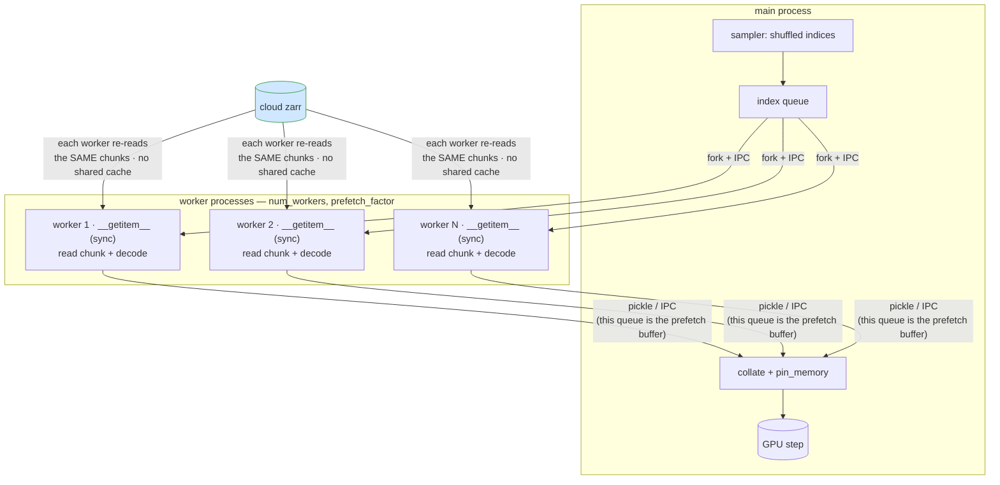
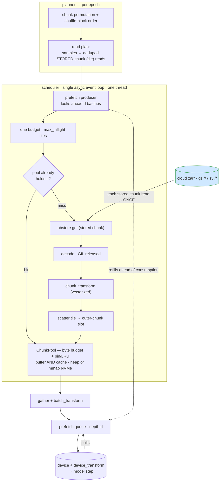
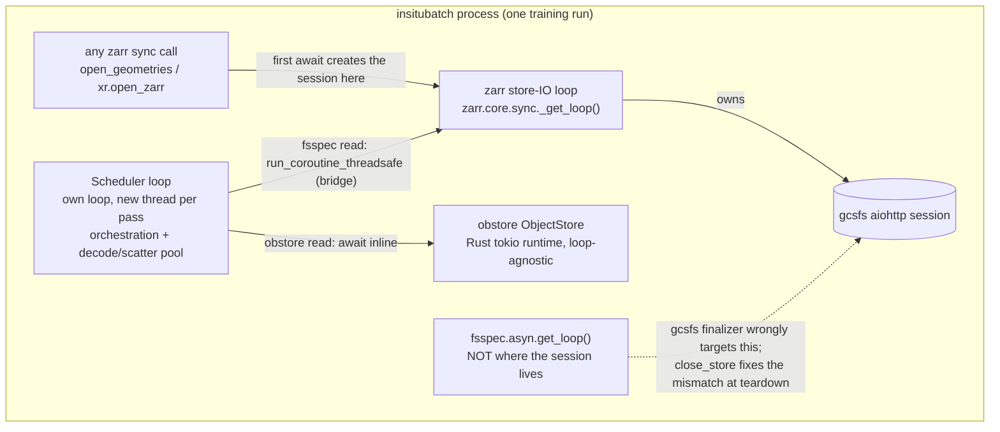
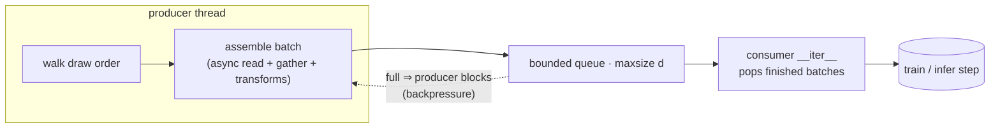
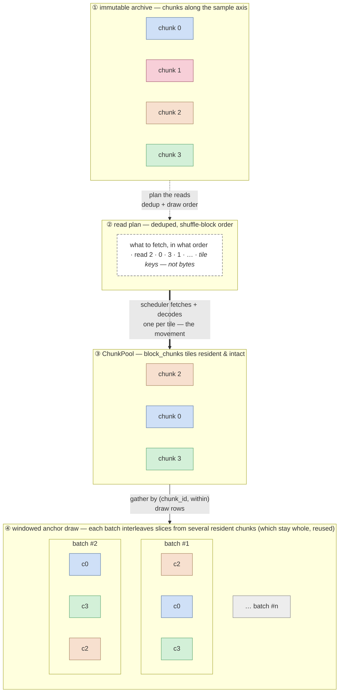

# Architecture: loaders, parallelism, and prefetch

This doc contrasts the classic worker-based data loader with insitubatch's
async-driven engine, then specifies the prefetch pipeline, the sample-geometry contract, and
how downstream frameworks integrate. For the why behind the project see
[DESIGN.md](https://github.com/emfdavid/insitubatch/blob/main/DESIGN.md).

## The inversion in one line

Classic `DataLoader`: parallelism lives in **`num_workers` OS processes**, each
running a *synchronous* `__getitem__`. insitubatch: parallelism lives in **one
async event loop**; batch assembly is the consumer. That move is what unlocks
async obstore, a shared chunk cache, bounded memory, and prefetch overlap.

## Classic worker-based loader



Frictions against cloud ndim zarr:

- **No shared chunk cache** — a chunk is fetched + decompressed once *per worker*
  whose samples land in it.
- **Sync `getitem` can't drive async obstore** — no way to fan out concurrent
  range reads from inside a worker.
- **dask thread pool nested in each worker** — procs × threads oversubscription,
  slow fork startup, fat memory.
- **The fork-safety tax** — a modern object store (obstore) runs a Rust **tokio**
  runtime. `fork` (the Linux default for workers) copies only the calling thread
  and leaves that runtime's threads dead with their locks held, so the *first read*
  in a forked worker **deadlocks**. Every escape is a cost the process model
  imposes: `spawn` (relaunch the interpreter per worker), `forkserver` (keep a
  pristine pre-fork server around), or a stack that rebuilds its loop on a PID
  change (s3fs/gcsfs) — and even that only if the store is *reopened in the worker*,
  never inherited across the fork. An obstore handle opened pre-fork deadlocks; a
  gcsfs one raises `Future attached to a different loop`. We hit both: the obstore
  `workers` baseline hung under fork, and the gcsfs xbatcher example raised — so
  fork is off the table for async cloud stores.
- Note: the worker model *does* prefetch (via `prefetch_factor` — workers run
  ahead into the IPC result queue). Prefetch is not the differentiator; **how**
  we prefetch is.

> **Why this is the argument for the single loop.** Every friction above — no
> shared cache, sync IO that can't drive obstore, thread oversubscription, the
> fork-safety tax — follows from putting parallelism in OS *processes*.
> insitubatch drives one in-process event loop (`num_workers=0`): there is no
> fork, so there is no fork-safety tax, no per-worker runtime to relaunch, and the
> chunk cache and the obstore runtime are simply shared. The deadlock we hit
> benchmarking the baseline is a symptom of the very thing we replace.

### Startup latency — the inference angle

Training amortizes worker spin-up over many epochs, so the start-method tax above
mostly disappears. **Inference does not**: you typically make a single pass from a
cold loader, and a long-lived server holding a `DataLoader` open (pinned workers,
held file handles) is rare. There, time-to-first-batch is dominated by process
startup. The worker model's best case is `forkserver` with
`set_forkserver_preload([...])` — heavy imports paid once in the server, forked
workers skip them. insitubatch's first batch is just the first read: no processes
to start. The two runnable examples make this concrete and measurable:
[`examples/wb2_dataloader.py`](https://github.com/emfdavid/insitubatch/blob/main/examples/wb2_dataloader.py)
(insitubatch) and
[`examples/wb2_xbatcher.py`](https://github.com/emfdavid/insitubatch/blob/main/examples/wb2_xbatcher.py)
(`--compare` prints TTFB across `spawn` / `forkserver` / `forkserver-preload`),
both on the public WeatherBench2 ERA5.

## insitubatch async-driven pipeline



The unit of work is the **stored chunk** (an `(outer, inner)` tile), and one
`max_inflight` budget spans every fetch — so read concurrency is one dial, with no
nested inner/outer caps. Each decoded tile is scattered into its outer chunk's slot
in the **ChunkPool**, which is the assembly buffer *and* the cache in one: a byte
budget with pin/unpin + LRU, backed by heap or an mmap'd `.npy` on NVMe. Before
fetching, the scheduler asks the pool whether it already holds a chunk — a hit
(cross-epoch, since the pool persists) skips fetch + decode + transform entirely.

Properties: parallelism in the loop (not processes); each stored chunk read once
and amortized across every sample that touches it; **read concurrency
(`max_inflight`) and residency (the pool's byte budget) are independent dials**;
total memory is the budget + the prefetch queue (depth `d`) + the in-flight tiles —
every term a tunable cap, none scaling with batch size or epoch length.

### Event-loop ownership (fsspec backends)

A genuinely-async fsspec backend (gcsfs, s3fs) binds its aiohttp session to the *first
event loop that awaits it*, permanently — no constructor knob pins it. For a zarr store
that first loop is **zarr's** process-wide store-IO loop (`zarr.core.sync._get_loop()`),
because any zarr sync call (`open_geometries`, `xr.open_zarr`, user code) touches the
store first. That is the correct owner: the session living on zarr's loop is what keeps
the store drivable by *any* zarr code — so insitubatch **conforms** (routes its reads
there) rather than hijacking the session onto its own loop, which would break every other
zarr-sync consumer in the process. The scheduler keeps its own orchestration loop and
bridges each fsspec read to zarr's loop (`run_coroutine_threadsafe`); obstore is
loop-agnostic (Rust runtime) and is awaited inline. Teardown closes the session on its own
loop (`close_store`), so gcsfs's finalizer — which wrongly targets
`fsspec.asyn.get_loop()` — becomes a no-op.



Collapsing the two loops into one — running the scheduler's orchestration *on* zarr's
loop for all backends, deleting the bridge and the per-pass thread churn — is planned
under M-GCS in [DESIGN.md](https://github.com/emfdavid/insitubatch/blob/main/DESIGN.md).

## Sample geometry — the axis-role contract

This is the stable contract the engine commits to, and the extension points reserved
for it. (For *why* it evolved this way — and why the tempting generalizations are
deferred — see the "Sample geometry" entry in
[DESIGN.md](https://github.com/emfdavid/insitubatch/blob/main/DESIGN.md).)

Every physical axis of a zarr array has one **role**:

- **sample axis** — the axis the engine draws / shuffles / splits / windows along.
  Exactly **one** per variable. `ArrayGeometry.sample_axis` names it as a *physical*
  axis index (default `0`: time for ERA5/HRRR; `2` for the `Z` of an OME-NGFF
  `(T,C,Z,Y,X)` microscopy stack sampled slice-by-slice — `open_geometries(store,
  sample_axis=2)`). A sample is a slice along this axis that **does not cross a chunk
  boundary**.
- **field axis** — every other axis, carried **whole** as the per-sample payload
  (`inner_shape`). Field axes may be *inner-chunked* (the ARCO/ERA5 norm); the engine
  fetches each field axis's tiles and assembles them, decode-once, into the sample's
  slot.

`ArrayGeometry.shape`/`chunks` are in **physical** (zarr) order — they mirror the
array metadata. The engine works in a *logical* view where the sample axis leads; the
single physical↔logical permutation is confined to the scheduler (address the store
key via `physical_chunk_coord`; `moveaxis` the decoded tile sample-first). With
`sample_axis=0` both are identities, so the common path is untouched.

**Windowing** is orthogonal to axis choice: a variable is a `(label, path, offset)`
view, and `g.shift(k)` reads `array[anchor + offset]` *along the sample axis*. Several
views of one array (same `path`, different `offset`) decode once and share slots — the
forecasting `{"x": g, "y": g.shift(horizon)}` pattern, which composes with any
`sample_axis`.

**The frozen promises (an API a v0.1 user can build against):**

- `Batch.arrays[label]` is always `(batch, *sample_inner)` — a leading batch axis plus
  the per-sample payload. Future capabilities change what `sample_inner` *resolves to*,
  never this shape.
- The `(label, path, view)` variable model, decode-once dedup on shared `path`, and the
  window helpers (`Batch.sample_indices` / `offsets` / `read_indices` / `stack`).
- Framework adapters infer tensor shape from `view.geometries` (post-transform
  `inner_shape`/`dtype`).

**Reserved extension points (committed as *additive*, not yet built):**

- **Multiple sample axes** (a product index — HCS `Well×Field×Time`, `Year×Day`).
  `sample_axis: int` widens to `int | tuple[int, ...]` non-breakingly (a scalar still
  means one axis). *Deferred:* a tuple trades away the "sample is a contiguous range in
  one axis" invariant and pulls in the full product-draw-space refactor — see DESIGN.md.
- **Patch / sliding-window sampling** (crop a giant field into `(64,64)` tiles). A field
  axis gains an *extent* (declarative geometry); the crop *origins* are a sampler policy
  (a strided grid, or a random draw — random crop already works today as a
  `batch_transform` over the whole field). Memory-optimal patching (read only the tiles a
  crop touches) is a pool/residency change, not a `Batch`-contract change.
- Cross-node concatenation (many well-arrays into one stream) is a **catalog layer above
  the core**, not part of this contract.

### Use-case support

Concrete cross-domain use cases against the contract above — what works today, what is a
reserved (additive) extension, and what is deliberately out of scope.

**Supported now:**

| Use case | Example | How |
|---|---|---|
| Train over a time/sample axis | ERA5/HRRR reanalysis; astronomy light curves | `sample_axis=0` (default) |
| Sample over *any* single axis | OME-NGFF 2D segmentation over `Z`; `T`-frame or volumetric stacks | `open_geometries(store, sample_axis=2)` |
| Paired inputs+targets with *different* sample-axis chunking | microscopy raw image + label mask (Z-chunk 1 vs 30) | two variables, one manifest |
| Multiple co-registered variables at one anchor (data + mask + weight) | radio astronomy MSv4 visibilities: `VISIBILITY` + `FLAG` + `WEIGHT`, sampled over `time` | variables share one manifest |
| Forecasting input/target windows | weather: input@`t`, target@`t+h` | `g.shift(h)` views (decode-once) |
| Whole inner field per sample, spatial grid fetched decode-once | ARCO/ERA5 `721×1440` fields; microscopy planes | inner (field) chunking |
| Cross-variable derived fields & per-sample random augmentation | `windspeed=√(u²+v²)`; random crop of the whole field | `batch_transform` |
| Chunk-aligned splits, block shuffle, cross-run cache | all domains | shipped |

**Reserved (committed as additive, not yet built):**

| Use case | Example | Extension |
|---|---|---|
| Multiple sample axes (product index) | HCS `Well×Field×Time`; `Year×Day` | `sample_axis` widens `int → int \| tuple` |
| Native spatial patch / sliding window (memory-optimal crops) | ERA5 `64×64` patches for a ViT; radio-astronomy cubes | patch *extent* (geometry) + origin sampler + partial-field residency |
| GPU `device_transform` stage | any | milestone M2 |

**Out of scope (by design):**

| Not supported | Example | Why |
|---|---|---|
| Cross-chunk / cross-sample-boundary stencils | finite differences across a time-chunk seam | a sample cannot span a chunk boundary |
| Cross-node concatenation into one stream | many HCS well-arrays as one dataset | catalog layer above the core |
| General compute graph / cross-chunk reductions | lazy dask-style evaluation | dask is off the hot path by design; reductions run *over* the loader |
| Resharding into a sample-per-file format | MDS/tar/WebDataset ETL | we train **in place**, no reshard |
| Scattered / boolean sample selection for splits | arbitrary index masks | splits are chunk-contiguous (leakage-safe) |

**Mapping a new domain onto the contract — worked example: radio astronomy (MSv4).** The
[xradio](https://github.com/casangi/xradio) MeasurementSet-v4 visibility dataset stores
`VISIBILITY` `(time, baseline_id, frequency, polarization)` (complex) alongside `FLAG`
(same shape, boolean) and `WEIGHT`. This is the same shape as the shipped microscopy case:
pick the **sample axis** (`time` for per-integration samples, or `frequency`/`baseline_id`),
carry the rest as the inner field, and gather `VISIBILITY` + `FLAG` + `WEIGHT` at one anchor
from **one manifest** — no reshard. The natural task, **RFI-flag detection** (predict `FLAG`
from `|VISIBILITY|`), is the segmentation pattern with an amplitude-threshold baseline in
place of Otsu. Complex data needs no special support: take `np.abs()` in a `batch_transform`
(or at the model boundary), so the numpy `Batch` and the DLPack adapters only ever see real
arrays. This is a schema-level mapping, not yet a shipped example — but every capability it
needs is validated today.

## Prefetch

`source.InSituDataset.__iter__` runs a **background producer thread** that
assembles batches ahead of the consumer:

- ✅ **Intra-batch concurrency** — a batch's missing chunks are fetched
  concurrently via the async loop (stored-chunk fan-out under `max_inflight`).
- ✅ **Inter-batch overlap** — the producer assembles batches N+1..N+`depth`
  while the caller works on batch N; the consumer just drains a bounded queue. (A
  demand-driven loop would leave the event loop idle during the compute step.)

### Design (producer/consumer pipeline)



- **Producer** starts the scheduler over the epoch's chunks, then per shuffle-block
  waits the block assembled, gathers its batches, and unpins it, pushing batches to
  a bounded `queue.Queue(maxsize=d)`.
- **Consumer** (`__iter__`) just pops finished batches → the train/infer step
  overlaps with IO+decode+assembly of the next `d` batches.
- **Backpressure / memory bound** — queue depth `d` + the pool's byte budget cap
  residency; a full queue pauses the consumer, a full budget pauses admission.
- **Continuous fetch** — the scheduler keeps `max_inflight` tiles in flight across
  block boundaries, and the budget (sized to ~two blocks) lets it admit the next
  block while the current one drains, so block-boundary IO overlaps compute. (At
  zero per-batch compute the loader is IO-throughput-bound, so the boundary is only
  smoothed, not removed — the network ceiling, not a scheduling gap.)
- **Lifecycle** — early consumer exit sets a stop flag and drains the queue so a
  producer parked on a full `put` can exit before the scheduler is closed.
- **Knobs:** `prefetch_depth` (queue depth `d`), `max_inflight`, `block_chunks`,
  `cache_budget_bytes`.

Same shape as `torchdata.nodes.Prefetcher`, but async-native. This is what turns a
throughput win into a *GPU-fed* win.

## Trade-offs: chunk size, shuffle window, concurrency, batch size

Four dials shape throughput and memory, and the engine keeps them as independent as possible
so you can move one without paying on the others. This is the model behind them; for the
values to actually set, see [Tuning](tuning.md).

| dial | what it trades | bounded by |
|---|---|---|
| **stored-chunk size** (`inner_chunks`, write time) | fetch granularity ↔ per-request overhead | a tile of ~10–50 MB |
| **read concurrency** (`max_inflight`) | network saturation ↔ in-flight memory | the store's raw-GET knee |
| **shuffle window** (`block_chunks`) | shuffle quality ↔ resident memory | RAM / cache budget |
| **batch size** (`batch_size`) | the model's step size | the window's sample pool |

**Chunk size is the amortization lever.** insitu reads each stored chunk once and gathers
every sample inside it, so the work saved versus a per-sample `__getitem__` grows with
samples-per-chunk. Fat chunks amortize more; the one-sample-per-chunk (GRIB) end has nothing
to amortize. Chunk size also sets the memory *unit* — residency is counted in whole outer
chunks.

**Stored-chunk size decouples concurrency cost from chunk size.** When a chunk is split into
an inner grid of tiles, a read fetches a *tile*, not the whole chunk, so raising
`max_inflight` costs tile-sized memory, not chunk-sized. That is why "fat, spatial" is the
sweet spot and "fat, single inner" is not: with one tile per chunk the two collapse and
concurrency costs full chunks. The [decoupled scheduler](#insitubatch-async-driven-pipeline)
is what makes read concurrency and residency independent dials in the first place.

**Batch size is largely orthogonal to IO.** A batch is a vectorized gather from the resident
window, so batch size sets the step the model sees, not the read pattern — as long as the
window's pool (`block_chunks × samples-per-chunk`) stays well above it.

### Why the block-local shuffle is enough

The shuffle is **approximate, not global**: chunks are permuted each epoch, and within a
window of `block_chunks` chunks all samples are shuffled together (the [scope
boundary](#what-this-does-not-do-scope-boundaries) on exact shuffle explains why a global
shuffle is incompatible with chunk-aligned, low-copy reads). Two things make that converge to
a full shuffle in practice:

1. **Within an epoch**, each batch is a uniform draw from the window's pool of
   `block_chunks × samples-per-chunk` samples. Keep that pool well above `batch_size` and a
   single batch is already well-mixed locally.
2. **Across epochs**, the per-epoch chunk permutation re-randomizes *which* chunks share a
   window, so any two samples' chunks eventually co-occur. Over a run the set of samples a
   given sample is ever batched with approaches the whole dataset.

So even a modest window asymptotes quickly toward a global shuffle over the many epochs
training actually runs — at memory cost `O(block_chunks)`, not `O(dataset)`.
[`shuffle_quality`](api.md) scores an emitted order against a perfect global shuffle if you
want to see it on your own data. (`shuffle=False` swaps in a sequential order — chunks and
samples in order — for eval / inference / reconstruction.)

### Read-once and sample-once

The pipeline holds two guarantees, and they are **orthogonal** — batch size touches neither:

- **read-once** — a stored tile is fetched and decoded exactly once, however many samples,
  batches, or epochs reference it (the read plan dedups; the `ChunkPool` keeps it resident;
  gather reads from the slot).
- **sample-once** — each valid sample lands in exactly one batch.

`order` is the ledger for sample-once: an `(N, 2)` array of `[chunk_id, within]`, one row per
drawn sample. It is a permutation of every valid anchor, so each sample appears once. The
**sample-level fancy index is never stored** — `gather` recomputes it per batch from the rows
(`anchor = chunk_id·spc + within`; `sample = anchor + offset`; scatter `slot.data[within[mask]]`
per unique read chunk), Python work `O(chunks-in-batch)`, never `O(samples)`.

The figure traces one epoch, archive → batch. Colour tracks the *bytes* — a chunk keeps its
colour from the archive ① through the resident pool ③; the **read plan** ② in between is
metadata (tile keys in shuffle-block order, *not* bytes), so the plan (dashed) stays distinct
from the movement (thick). In stage ④ a batch is a row of colour-coded slices drawn across
several resident chunks: one chunk feeds many batches yet is **never broken up** — it stays
whole and reused, which is what read-once buys. (Loaders that pre-shuffle to disk instead
dissolve the chunk into scattered rows; see the annbatch contrast in
[DESIGN.md](https://github.com/emfdavid/insitubatch/blob/main/DESIGN.md#what-it-is-by-contrast).)



**"Exactly once" means every *valid* anchor.** `order` is built to handle the edges: a **short
final chunk** emits `within` only up to its real length, and windowed sampling drops anchors
whose `anchor+offset` would read off the array (incomplete windows — correct to skip for
training; the inference path validates the range and raises instead). Guaranteed by
`test_order_covers_every_sample_exactly_once`, `test_order_handles_partial_final_chunk`, and
the decode-once suite.

**The tail is ragged per block, not per epoch.** Batches do not span shuffle blocks: the
producer batches `order` within each block's row range and restarts at the boundary. So when a
block's sample count (`≈ block_chunks × spc`, minus edges) is not a multiple of `batch_size` —
the common case — the **last batch of every block is short**. No sample is lost or duplicated
(sample-once holds), but an epoch yields *several* short batches, and steps-per-epoch is
`Σ ⌈block_samples / bs⌉`, not `⌈N / bs⌉` — worth knowing for BatchNorm on a small tail or
step-count math. There is deliberately no `drop_last` today; whether to add one is an open
question (see Known limitations in
[DESIGN.md](https://github.com/emfdavid/insitubatch/blob/main/DESIGN.md#known-limitations--defects)).

## Transforms — three stages, placed by cost

Models need preprocessing (at minimum scaling; often regridding). The interesting
question is *where* a transform runs, because placement is a performance lever
tied to the core principle (Python work scales with **chunks, not samples**).

```
read → decode ─►[chunk_transform]─► buffer → gather ─►[batch_transform]─► DLPack ─►[device_transform]─► model
                   O(chunks)                              O(batches)                    O(batches), on GPU
                   amortized over every                   needs the                     cheap-on-device
                   sample in the chunk                    assembled batch               ops
```

1. **`chunk_transform(DecodedChunk) -> DecodedChunk`** — per-chunk, on the decode
   thread pool, **before** shuffle/gather. Amortized over every sample that draws
   from the chunk. Home for per-element, sample-order-independent ops: **scaling /
   normalization, unit conversion, dtype cast, chunk-local regrid.** Sees one
   variable, one chunk (`chunk.read.array` gives the variable).
2. **`batch_transform(Batch) -> Batch`** — per-batch, after gather. For ops that
   need the assembled batch: **cross-variable derived fields, channel stacking,
   per-sample random augmentation/crops, collation to model layout.**
3. **`device_transform`** — in the framework adapter, after DLPack, on-GPU,
   overlapping compute. For ops cheap on device (GPU normalization, batched
   interpolation, FFTs).

**Placement principle:** push each transform as early and as shared (per-chunk) as
possible; move later only when it needs the batch, per-sample randomness, or is
cheaper on-device. A per-sample transform in `__getitem__` (the torch way) redoes
work for every reused sample — we refuse that by default.

**Free advantage:** parallelism is in one event loop, not worker processes, so
transforms need **not** be picklable — stateful normalizers, closures, GPU objects
all work. torch's DataLoader forces picklable transforms across `fork`.

Runnable side-by-side example:
[`examples/transforms.py`](https://github.com/emfdavid/insitubatch/blob/main/examples/transforms.py)
— a Kelvin→Celsius `chunk_transform` (one variable, cached) and a cross-variable windspeed
`batch_transform` (needs the assembled batch, uncached).

### Standard scaler — pre-fit GLOBAL stats (not per-chunk)

```python
@dataclass
class StandardScaler:
    """Global per-variable (optionally per-level) standardization with PRE-FIT,
    FIXED stats. Applied identically to every chunk — never recomputed per chunk."""
    mean: dict[str, np.ndarray]   # per var, shaped to broadcast: surface (1,1); per-level (level,1,1)
    std:  dict[str, np.ndarray]
    eps: float = 1e-8
    def __call__(self, chunk: DecodedChunk) -> DecodedChunk:
        m, s = self.mean[chunk.read.array], self.std[chunk.read.array]
        chunk.data = (chunk.data - m) / (s + self.eps)
        return chunk
```

Pre-fit the stats however you like and pass them in. The recommended way is to fit
*over the loader itself* with scikit-learn's incremental `StandardScaler.partial_fit`
— covered next — which also warms the cache. `StandardScaler` above is then the
*chunk*-stage applier, for when you want the normalization cached with the decoded
chunk; the fit pass and the apply stage are independent.

**Alternative: fit at the *batch* stage with community tooling, warming the cache.**
Standardization is elementwise, so per-chunk and per-batch are identical — which means
you can also fit it *over the loader itself*: iterate once with no scaler (decoding +
**caching** the raw chunks) while a `sklearn.preprocessing.StandardScaler.partial_fit`
(or `dask_ml`) accumulates per-variable stats, then attach the fitted scaler as a
`batch_transform`. The cache then holds **raw** chunks — normalization-agnostic and
reusable across experiments — and the fit pass *is* the warm-up; training reads
decode-once. It also composes cleanly with a preceding `chunk_transform` (a regrid),
since the fit sees the chunk stage's output. Runnable:
[`examples/fit_scaler.py`](https://github.com/emfdavid/insitubatch/blob/main/examples/fit_scaler.py).

### Regrid — precomputed weights, placement by regime

```python
@dataclass
class Regrid:
    """Bilinear lat/lon → target grid. Chunk-local (spatial dims whole per chunk).
    Weights computed ONCE; apply is a vectorized sparse gather. inner_shape changes
    consistently across chunks."""
    src_lat, src_lon, dst_lat, dst_lon: np.ndarray
    def __post_init__(self):
        self._idx, self._w = _bilinear_weights(self.src_lat, self.src_lon,
                                               self.dst_lat, self.dst_lon)
    def __call__(self, chunk: DecodedChunk) -> DecodedChunk:
        chunk.data = _apply_weights(chunk.data, self._idx, self._w)
        return chunk
    def output_inner(self, geom: ArrayGeometry) -> tuple[tuple[int, ...], np.dtype]:
        return (len(self.dst_lat), len(self.dst_lon)), geom.dtype  # new inner shape
```

A **reshaping** `chunk_transform` declares `output_inner` so the cache can size its slot at
the post-transform shape (see [the caching section](#the-caching-continuum)); a
shape/dtype-preserving one (scaling) omits it. Only the inner dims and dtype may change — the
sample axis is the engine's to keep.

- **Fat chunks** → `chunk_transform` (amortized over the chunk's samples).
- **ARCO `chunk-1`** → reuse the same weights as a sparse tensor in a
  `device_transform` (batched on GPU), since per-chunk == per-sample there.

### Developing a transform — `check_transform`

Both transform contracts (vectorized/GIL-releasing, and a correct `output_inner`) are easy to
get wrong and otherwise only surface at training time. Run the bundled CLI against **one chunk
of your real store** while you write the transform:

```bash
# a runnable example against the public WeatherBench2 ERA5, checking the bundled K->C transform:
insitubatch-check-transform \
    gs://weatherbench2/datasets/era5/1959-2022-6h-128x64_equiangular_with_poles_conservative.zarr \
    --var 2m_temperature --transform examples/transforms.py:kelvin_to_celsius --skip-signature
# your own:  insitubatch-check-transform s3://bucket/era5.zarr --var t2m --transform ./prep.py:Regrid
#            (target is module:attr or path.py:attr; a transform class is instantiated)
```

It prints the chunk geometry (the decoded MB the cache will hold), runs the transform on real
data, **validates a declared `output_inner` against the actual output** (catching the mismatch
`ChunkPool._persist` would later raise, or a reshape that forgot to declare one), and runs a
thread-scaling probe that flags a transform holding the GIL — a pure-Python per-element transform
that would serialize the decode pool. Non-zero exit on a failed check, so it can gate a
pre-commit hook. `--no-gil-probe` does the geometry + cacheability checks only (fast,
deterministic); the GIL probe wants a realistically-sized chunk (a toy array is dominated by
per-call overhead). `--skip-signature` / `--request-payer` read public / Requester-Pays stores.

## Bad / corrupt chunks

Real archives — especially GRIB-under-zarr (HRRR) — ship the occasional truncated or
corrupt stored chunk. By default a decode failure **fails fast** (`on_bad_chunk="raise"`).
Set `on_bad_chunk="nan"` and a bad (or missing) tile is filled with NaN (float dtypes)
or the array's fill value instead of poisoning the epoch — the outer chunk assembles
with a hole that you repair with an ordinary `chunk_transform`:

```python
def fill_nan(chunk):                      # your policy: climatology, interpolate, ...
    np.nan_to_num(chunk.data, copy=False, nan=0.0)
    return chunk

ds = InSituDataset(store, manifest, on_bad_chunk="nan", chunk_transforms=[fill_nan])
for batch in ds.train:
    ...
print(ds.bad_chunks)   # the (array, chunk_index, inner_coord) reads that were bad this epoch
```

Granularity is the **stored** chunk (tile), so one corrupt inner tile NaNs only its
region of the outer chunk, not the whole field. A failure *during scatter* (a genuine
bug, not a bad chunk) still poisons — the policy only covers fetch/decode. Dropping
NaN-containing *samples* is deliberately not automatic (it would break the fixed-shape
vectorized gather); exclude known-bad chunks at the split/manifest level instead
(`ds.bad_chunks` gives you the list to quarantine).

## Splits — chunk-aligned and leakage-safe

Train/val/test are partitioned **ahead of time, at chunk granularity** along the sample
axis — `split_by_chunk` assigns whole chunks to each split, never individual samples. Two
reasons:

- **No leakage.** A sample never straddles a split boundary, and the temporally adjacent,
  autocorrelated samples inside a chunk can't land on opposite sides of train/val.
- **Reads stay chunk-aligned.** Every read serves exactly one split — no half-chunk waste,
  no sample shared between two splits.

The result is a `SplitManifest` (which chunk indices belong to each split), persisted as JSON
for reproducibility; the dataset's views (`ds.train` / `ds.val` / `ds.test`) read from it.

**`contiguous` is the decision to get right.** By default (`contiguous=True`) each split is a
*contiguous block* of chunks — the safe choice for time series, where a randomly interleaved
split still leaks through autocorrelation across chunk boundaries (a val chunk wedged between
two train chunks shares its neighbours' weather). Set `contiguous=False` only when samples are
**exchangeable** (independent scenes); it shuffles chunks before partitioning.

```python
from insitubatch import obstore_store, open_geometries, split_by_chunk

store = obstore_store(url)                 # or fsspec_store / arraylake_store
geom = open_geometries(store)[var]
# time series (default): contiguous blocks, no cross-boundary leakage
manifest = split_by_chunk(geom, fractions=(0.8, 0.1, 0.1))
# independent scenes: shuffle chunks before splitting
manifest = split_by_chunk(geom, fractions=(0.8, 0.1, 0.1), contiguous=False)
```

`fractions` are fractions of *chunks*, not samples (for many chunks the two converge). See
`split_by_chunk` in the [API reference](api.md) and "Splits" in
[DESIGN.md](https://github.com/emfdavid/insitubatch/blob/main/DESIGN.md) for the rationale.

### Subsetting to a window — define it with xarray

The `SplitManifest` records *which sample-axis chunks* belong to each split, so to
train on a window of a long archive you just restrict the manifest. `split_by_chunk`
takes a `sample_range=(start, stop)` of sample indices and keeps the chunks overlapping
it before partitioning. And because you probably think in *time*, not indices, you can
define the window with the **xarray API you already know** and translate it — xarray is
used only for this off-hot-path planning step; the engine itself never touches xarray:

```python
import xarray as xr
from insitubatch import InSituDataset, obstore_store, open_geometries, split_by_chunk

store = obstore_store(url)                 # one Store, reused for planning + the engine

# define the window in xarray
xds = xr.open_zarr(store)
sel = xds.sel(time=slice("2020-01-01", "2021-01-01"))
times = xds.indexes["time"]
i0 = times.get_loc(sel.time.values[0])
i1 = times.get_loc(sel.time.values[-1]) + 1  # half-open

# pure zarr/numpy from here
geom = open_geometries(store)[var]
manifest = split_by_chunk(geom, fractions=(0.8, 0.1, 0.1), sample_range=(i0, i1))
ds = InSituDataset(store, manifest, ...)
```

**Limitation — chunk-aligned and contiguous.** The selection snaps *outward* to chunk
boundaries: a window that starts or ends mid-chunk pulls in that whole partial edge
chunk, because splits are chunk-granular (you subset whole chunks, never individual
samples). For day/hour chunks against a multi-month window that's effectively exact.
It is **only** for a single contiguous window — scattered/boolean selections (e.g.
"summers only") don't map cleanly, since straddling chunks would silently re-add the
samples you meant to drop. Subsetting the *inner* (spatial) axes is a separate, later
feature.

## The caching continuum

**The cache boundary IS the chunk-transform boundary.** Every chunk is keyed
`(array, chunk_index)`, and `chunk_transforms` are deterministic and applied before
shuffle — so what's worth keeping is the **decoded + scaled + regridded** array, and
a hit skips fetch *and* decode *and* normalize *and* regrid (not just bytes).
`batch_transforms` (per-sample / random, post-shuffle) run after and are never
cached. So `chunk_transforms` are exactly the deterministic prefix safe to persist.

Dedup → buffer → cache is **one continuum** — and in the engine it is literally one
object, the `ChunkPool`, parameterized by a byte budget:

| layer | reuse scope | how |
|---|---|---|
| read-plan dedup | within a request | a chunk's tiles are fetched once, scattered into one slot |
| assembly buffer | within an epoch | a small budget (the working set, ~2 blocks) |
| cache | across epochs | a large budget retains drained chunks |

A chunk is **pinned** while the current epoch needs it; once its shuffle-block is
drained it becomes **unpinned** — LRU-evictable but not dropped. The pool drops
unpinned chunks only under budget pressure (evicting LRU to admit a miss). With a
small budget that is prompt — the read-once buffer, where each chunk is still
read+decoded **once per epoch** (a naive per-batch eviction would re-read chunks
whose samples scatter across a shuffle block). Raise the budget past the working set
and drained chunks linger, so a still-resident prepped chunk is a cross-epoch hit:
the same machinery becomes the cache by *"don't evict."*

Backing is **heap or mmap** (`cache_dir` → mmap'd `.npy` on local NVMe): the scatter
writes straight into the slot either way, so a hit needs no copy out of a separate
cache. mmap makes the footprint reclaimable kernel page cache, bounded on disk by
bytes, so the working set stays bounded. Caching the *prepped* representation is
strictly stronger than a raw-byte NVMe cache for an ML pipeline. The default budget
is the working set (read-once); raise `cache_budget_bytes` to cache.

**Heavy-reuse tasks unlocked:** multi-epoch training (epoch 0 warms it); the
fat-chunk regime (one chunk → many batches); scoring/verification (reference chunks
reused across metrics, lead times, models); datasets that fit in RAM/NVMe
(effectively in-memory at GPU-fed speed after the first pass).

### Two cache models: chunks vs batches

insitubatch and xbatcher both cache — they cache *different things*, and each choice
buys something real. [xbatcher](https://github.com/xarray-contrib/xbatcher) serializes
**assembled batches** to a zarr store; insitubatch retains **decoded, chunk-transformed
chunks** in the pool. Caching whole batches is a deliberate design choice, not a
shortcut: it is exactly what lets xbatcher's cache survive process exit today.

| dimension | insitubatch — chunk pool | xbatcher — batch cache |
|---|---|---|
| unit cached | decoded + chunk-transformed **chunk** (deduped) | **assembled batch**, in batch layout |
| extra copy | none — `gather` views the slot in place | a separate materialized copy |
| key | `(array, chunk_index)` | batch index → zarr store |
| backing | heap or mmap'd `.npy` (reclaimable NVMe page cache) | zarr store (local dir or cloud) |
| cross-epoch reuse | intrinsic (just don't evict) | yes |
| cross-run persistence | **yes** — `persist=True` (see below) | **yes** — survives restarts |
| shuffle | sits *before* shuffle: sample→batch membership re-drawn every epoch | batch composition frozen; only batch *order* reshuffles |
| sweet spot | many samples per chunk, fat-chunk, multi-epoch, scoring reuse | one-sample-per-chunk, stable batch defs reused across runs |

Both persist across runs now; the distinction is the **unit**. insitu caches deduped
decoded chunks (no second copy, `gather` views the slot in place) and keeps a stronger
per-epoch shuffle because the cache is *upstream* of shuffling; xbatcher caches
materialized batches with frozen composition. Pick by regime, not by a missing feature.

### Cross-run persistence

`persist=True` (with a `cache_dir`) turns the mmap tier into a cache that **survives
process exit**: ready slot files are kept on `close`, an append-only
`insitu_cache.jsonl` log records each completed entry *the moment it lands*, and a fresh
dataset over the same `cache_dir` revives them as ready hits on first touch — the fetch
driver's existing hit path skips fetch *and* decode *and* transform, so a warm run
re-decodes **zero** chunks. Because the log is written incrementally (not at `close`), a
killed process — spot preemption, OOM, SIGTERM — still leaves a usable cache: the next
run re-decodes only the chunks that hadn't finished. Without `persist`, `cache_dir` is
ephemeral spill (files unlinked on close).

```python
ds = InSituDataset(store, manifest, cache_dir="/mnt/nvme/era5/v3",
                   persist=True, cache_budget_bytes=...)
```

Two guards keep a reopened cache honest:

1. a **chunk-transform fingerprint** in the log header — change your `chunk_transforms`
   (or bump the log format) and the cache is **stale**. A stale cache is almost never
   what you intended, so by default it **raises** at construction rather than silently
   rebuilding or serving stale data. Pass `reset_stale_cache=True` to opt into deleting
   the old files and rebuilding cold (or delete the `cache_dir` yourself); and
2. a per-entry **shape/dtype check** on revive — a chunk whose stored geometry no
   longer matches the current array is a **miss** (re-fetch + overwrite), never an error.

(Corruption or tampering — an unreadable header, a malformed interior entry, or a `file`
that isn't a bare basename — always raises, regardless of `reset_stale_cache`; that flag
governs an *expected* stale cache, not a damaged one.)

The fingerprint resolves each transform by, in order: an explicit `transform.cache_key`
(authoritative), a `cloudpickle` hash (the optional `cache` extra — captures closures
and referenced globals, so a changed closed-over constant invalidates), or a
best-effort source hash (catches an edited body but not a changed closure/global — it
warns once so the weaker guarantee is visible).

> **Limitation — the fingerprint is per-*pipeline*, not per-variable (invalidation is
> all-or-nothing).** `chunk_transforms` is a single ordered list applied to **every**
> variable; a transform that only concerns one field self-gates by name and no-ops on the
> rest (e.g. `kelvin_to_celsius` acts on `t2m`, returns `u10`/`v10` untouched). But the
> fingerprint hashes the **whole list once** and stamps that single `pipeline_hash` on
> every array's cache entries. So editing a transform that logically affects only `t2m`
> marks the **entire** cache stale — `u10`/`v10` included — even though their cached chunks
> are byte-identical (the edited transform no-oped on them); with the default you must then
> `reset_stale_cache=True` and re-decode everything. The engine also runs every transform
> on every chunk (the no-op passes are wasted work, though cheap for a name-gated early
> return). A per-variable transform assignment + per-array fingerprint would scope
> invalidation (and application) to just the affected arrays — see the roadmap in
> [DESIGN.md](https://github.com/emfdavid/insitubatch/blob/main/DESIGN.md).

**Observability.** `dataset.cache_hits` / `cache_misses` give per-epoch counts; a plain
miss is silent, but `persist=True` serving **zero** hits while the cache was
consulted-and-rejected emits one WARNING per epoch — a cache you configured but that
isn't working is loud, not silent.

**Invariants the engine guarantees:**

- The cache key is `(array_path, global chunk_index)` — the *absolute* zarr chunk index,
  not relative to a split or `sample_range`. So overlapping subsets/splits and a later
  fuller run **share** entries: chunk 5 is always the same `.npy`.
- A hit returns the **prepped** chunk (post-`chunk_transform`), no copy — `gather` views
  the slot in place.
- **Crash-safe:** each *completed* chunk is appended to the log as it finishes (flushed to
  the OS page cache, which survives process death), so a killed run keeps everything it
  decoded. The log is self-deduplicating (a re-completed chunk across epochs/runs is not
  re-appended) and bounded to one line per cached chunk — no compaction needed. A `.npy`
  left half-written by a crash was never logged, so it's simply overwritten on re-decode.

**What you must ensure (the guarantee boundary):**

- **The `cache_dir` path is the dataset identity.** The **store URL is not in the key**
  (an Icechunk/Arraylake session store has no round-trippable URL), so pointing one
  `cache_dir` at two sources that share array paths + geometry would serve the wrong
  chunks. Use a distinct dir per dataset and bury a version in the path (`…/era5/v3/`)
  that you bump when the **source data** changes — content/etag drift is deliberately
  not detected.
- **`chunk_transforms` must be deterministic** (they are baked into the cached chunk).
  When you edit one, its fingerprint changes and the cache goes stale — construction then
  **raises** until you pass `reset_stale_cache=True` (wipe + rebuild) or delete the dir.
  For the fingerprint to *notice* a change, install the `cache` extra (cloudpickle) or set
  an explicit `transform.cache_key`; the source-only fallback can miss closure/global
  changes (and would then wrongly serve the old cache as a hit).

**Reshaping transforms.** A **reshaping** `chunk_transform` (e.g. `Regrid`, or a dtype
recast) is a first-class cacheable stage on every backing including the persistent mmap
tier. The transform declares its post-transform *inner* geometry via
`output_inner(geom) -> (inner_shape, dtype)`; the engine sizes the cache slot at that
**output** shape and assembles decoded tiles into a transient **source**-shaped scratch
buffer, then writes the transformed result into the slot (the sample axis is spliced back
from the source, so a chunk_transform can never move it). Shape/dtype-preserving transforms
omit `output_inner` and keep the zero-copy fast path (the slot is buffer and cache in one).

**Limitations (deferred).** A raw-decoded tier (keyed by source only, for transform
experimentation) and the kvikio/GDS NVMe→GPU feed off the persistent `.npy` tier remain
on the roadmap
([DESIGN.md](https://github.com/emfdavid/insitubatch/blob/main/DESIGN.md)).

## Downstream integration — tensors, not xarray

insitubatch delivers **tensor batches** and never builds `xr.DataArray`. That decides how it
plugs into an xarray-native inference framework such as
[Earth2Studio](https://github.com/NVIDIA/earth2studio): **around the models, not inside their
xarray loop.** A raw `ObjectStore(obstore)` store-swap in such a framework's ARCO source buys
*faster bytes* — but that is an **obstore** win, not ours. insitubatch earns its place for
batched training / fine-tuning / hindcast scoring: read the ARCO/zarr store → DLPack →
`(torch.Tensor, coords)` and drive the model directly (the `coords` we supply is a light
`OrderedDict` of coordinate arrays — metadata, not the xarray machinery), instead of routing
every `(time, variable)` through the framework's per-request xarray `DataSource`. What that
adds over the store-swap is the **loader**:

- **Bounded fan-out** — one `max_inflight` budget vs an unbounded `gather` over thousands of
  timesteps; sustained throughput at bounded memory.
- **Read-plan dedup across a request** — ensembles, lead times, and overlapping verification
  windows touch the same chunks repeatedly; the plan collapses them to one read each.
- **Prefetch overlap** for sequential/autoregressive rollout, and split + shuffle for training.

A reference integration — an Earth2Studio `DataSource` backed by `InSituDataset` — is in
[emfdavid/earth2studio#1](https://github.com/emfdavid/earth2studio/pull/1).

## What this does NOT do (scope boundaries)

These are deliberate current boundaries — the design is honest about them rather than
pretending to be a general compute graph.

- **`chunk_transform` sees ONE variable and ONE chunk.** It cannot combine
  variables. So `windspeed = sqrt(U10² + V10²)` is **not** a chunk transform.
  - It *is* a **`batch_transform`** — the `Batch` holds all variables aligned on
    the sample axis (`batch.arrays["u10"]`, `batch.arrays["v10"]`), so derived
    cross-variable fields compute cleanly there. **Caveat:** batch transforms run
    *after* the cache, so a derived field is recomputed per batch/draw, not
    cached. A cached cross-variable **derived variable** (compute once from
    co-scheduled input chunks, store as a pseudo-chunk keyed like any other) is a
    deliberate **future** feature.
- **No cross-chunk / cross-sample-boundary ops.** A sample is a slice of the sample
  axis (any single physical axis — see "the axis-role contract") that does **not span a
  chunk boundary**. So temporal stencils or windows that straddle two chunks (e.g. finite
  differences across the seam, or a 6-step window crossing chunk edges) are not
  supported. Windows spanning *n* chunks are a future opt-in that trades away
  zero-copy.
- **A field (inner) axis is carried whole.** A sample is the *entire* payload on every
  non-sample axis; there is no spatial patching/cropping in the read yet, so a giant
  field is assembled whole (crop it in a `batch_transform`). Native patch geometry —
  and memory-optimal partial-field residency — is a reserved extension (see the
  axis-role contract).
- **Not a compute framework.** No general task graph, no cross-chunk reductions on
  the hot path, no lazy dask-style evaluation — by design (dask on the hot path is
  the thing we route around). Reductions like fitting a scaler run *over the loader*
  (e.g. sklearn `partial_fit`), not as a graph.
- **Shuffle is approximate**, not global — chunk permutation + shuffle-block
  (`block_chunks` is the quality↔memory knob). Exact global shuffle is
  incompatible with chunk-aligned, low-copy reads.
- **Variables must share the sample-axis *length*** — an enforced invariant;
  `InSituDataset` raises `ValueError` otherwise (samples are paired row-for-row across
  variables). They **may** chunk that axis *differently*: the manifest defines a reference
  anchor grid and each variable maps global anchors onto its own chunk grid, so an OME-NGFF
  raw array (Z-chunk 1) pairs with its label mask (Z-chunk 30) with no reshard. Which
  *physical* axis is the sample axis is also free (the axis-role contract) — only the
  *length* along it must match.

Rule of thumb: **per-variable, per-chunk, deterministic → chunk stage (cacheable).
Cross-variable or per-sample-random → batch stage (not cached). Cross-chunk →
not supported.**
