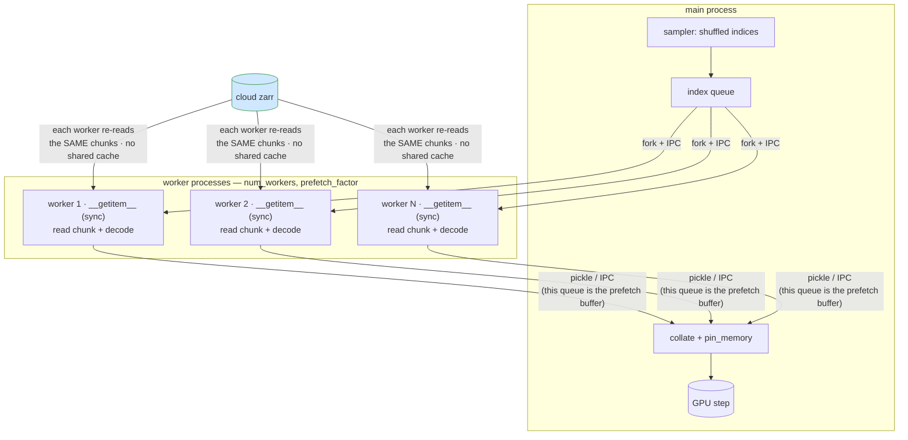
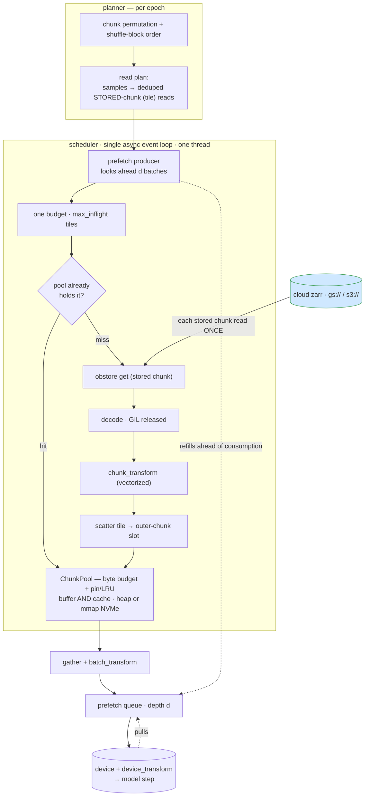
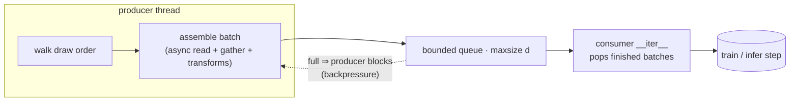

# Architecture: loaders, parallelism, and prefetch

This doc contrasts the classic worker-based data loader with insitubatch's
async-driven engine, then specifies the prefetch pipeline and the Earth2Studio
integration surfaces. For the why behind the project see
[DESIGN.md](https://github.com/emfdavid/insitubatch/blob/main/DESIGN.md).

## The inversion in one line

Classic `DataLoader`: parallelism lives in **`num_workers` OS processes**, each
running a *synchronous* `__getitem__`. insitubatch: parallelism lives in **one
async event loop**; batch assembly is the consumer. That move is what unlocks
async obstore, a shared chunk cache, bounded memory, and prefetch overlap.

## Classic worker-based loader



Frictions against cloud ndim zarr:

- **No shared chunk cache** — a chunk is fetched + decompressed once *per worker*
  whose samples land in it.
- **Sync `getitem` can't drive async obstore** — no way to fan out concurrent
  range reads from inside a worker.
- **dask thread pool nested in each worker** — procs × threads oversubscription,
  slow fork startup, fat memory.
- **The fork-safety tax** — a modern object store (obstore) runs a Rust **tokio**
  runtime. `fork` (the Linux default for workers) copies only the calling thread
  and leaves that runtime's threads dead with their locks held, so the *first read*
  in a forked worker **deadlocks**. Every escape is a cost the process model
  imposes: `spawn` (relaunch the interpreter per worker), `forkserver` (keep a
  pristine pre-fork server around), or a stack that rebuilds its loop on a PID
  change (s3fs/gcsfs) — and even that only if the store is *reopened in the worker*,
  never inherited across the fork. An obstore handle opened pre-fork deadlocks; a
  gcsfs one raises `Future attached to a different loop`. We hit both: the obstore
  `workers` baseline hung under fork, and the gcsfs xbatcher example raised — so
  fork is off the table for async cloud stores.
- Note: the worker model *does* prefetch (via `prefetch_factor` — workers run
  ahead into the IPC result queue). Prefetch is not the differentiator; **how**
  we prefetch is.

> **Why this is the argument for the single loop.** Every friction above — no
> shared cache, sync IO that can't drive obstore, thread oversubscription, the
> fork-safety tax — follows from putting parallelism in OS *processes*.
> insitubatch drives one in-process event loop (`num_workers=0`): there is no
> fork, so there is no fork-safety tax, no per-worker runtime to relaunch, and the
> chunk cache and the obstore runtime are simply shared. The deadlock we hit
> benchmarking the baseline is a symptom of the very thing we replace.

### Startup latency — the inference angle

Training amortizes worker spin-up over many epochs, so the start-method tax above
mostly disappears. **Inference does not**: you typically make a single pass from a
cold loader, and a long-lived server holding a `DataLoader` open (pinned workers,
held file handles) is rare. There, time-to-first-batch is dominated by process
startup. The worker model's best case is `forkserver` with
`set_forkserver_preload([...])` — heavy imports paid once in the server, forked
workers skip them. insitubatch's first batch is just the first read: no processes
to start. The two runnable examples make this concrete and measurable:
[`examples/wb2_dataloader.py`](https://github.com/emfdavid/insitubatch/blob/main/examples/wb2_dataloader.py)
(insitubatch) and
[`examples/wb2_xbatcher.py`](https://github.com/emfdavid/insitubatch/blob/main/examples/wb2_xbatcher.py)
(`--compare` prints TTFB across `spawn` / `forkserver` / `forkserver-preload`),
both on the public WeatherBench2 ERA5.

## insitubatch async-driven pipeline



The unit of work is the **stored chunk** (an `(outer, inner)` tile), and one
`max_inflight` budget spans every fetch — so read concurrency is one dial, with no
nested inner/outer caps. Each decoded tile is scattered into its outer chunk's slot
in the **ChunkPool**, which is the assembly buffer *and* the cache in one: a byte
budget with pin/unpin + LRU, backed by heap or an mmap'd `.npy` on NVMe. Before
fetching, the scheduler asks the pool whether it already holds a chunk — a hit
(cross-epoch, since the pool persists) skips fetch + decode + transform entirely.

*Built today:* planner, the scheduler + ChunkPool (cache included), chunk/batch
transforms, prefetch overlap, the torch surface. *Planned:* `Regrid` +
`device_transform`.

Properties: parallelism in the loop (not processes); each stored chunk read once
and amortized across every sample that touches it; **read concurrency
(`max_inflight`) and residency (the pool's byte budget) are independent dials**;
total memory is the budget + the prefetch queue (depth `d`) + the in-flight tiles —
every term a tunable cap, none scaling with batch size or epoch length.

## Prefetch

`source.InSituDataset.__iter__` runs a **background producer thread** that
assembles batches ahead of the consumer:

- ✅ **Intra-batch concurrency** — a batch's missing chunks are fetched
  concurrently via the async loop (stored-chunk fan-out under `max_inflight`).
- ✅ **Inter-batch overlap** — the producer assembles batches N+1..N+`depth`
  while the caller works on batch N; the consumer just drains a bounded queue. (A
  demand-driven loop would leave the event loop idle during the compute step.)

### Design (producer/consumer pipeline)



- **Producer** starts the scheduler over the epoch's chunks, then per shuffle-block
  waits the block assembled, gathers its batches, and unpins it, pushing batches to
  a bounded `queue.Queue(maxsize=d)`.
- **Consumer** (`__iter__`) just pops finished batches → the train/infer step
  overlaps with IO+decode+assembly of the next `d` batches.
- **Backpressure / memory bound** — queue depth `d` + the pool's byte budget cap
  residency; a full queue pauses the consumer, a full budget pauses admission.
- **Continuous fetch** — the scheduler keeps `max_inflight` tiles in flight across
  block boundaries, and the budget (sized to ~two blocks) lets it admit the next
  block while the current one drains, so block-boundary IO overlaps compute. (At
  zero per-batch compute the loader is IO-throughput-bound, so the boundary is only
  smoothed, not removed — the network ceiling, not a scheduling gap.)
- **Lifecycle** — early consumer exit sets a stop flag and drains the queue so a
  producer parked on a full `put` can exit before the scheduler is closed.
- **Knobs:** `prefetch_depth` (queue depth `d`), `max_inflight`, `block_chunks`,
  `cache_budget_bytes`.

Same shape as `torchdata.nodes.Prefetcher`, but async-native. This is what turns a
throughput win into a *GPU-fed* win.

## Transforms — three stages, placed by cost

Models need preprocessing (at minimum scaling; often regridding). The interesting
question is *where* a transform runs, because placement is a performance lever
tied to the core principle (Python work scales with **chunks, not samples**).

```
read → decode ─►[chunk_transform]─► buffer → gather ─►[batch_transform]─► DLPack ─►[device_transform]─► model
                   O(chunks)                              O(batches)                    O(batches), on GPU
                   amortized over every                   needs the                     cheap-on-device
                   sample in the chunk                    assembled batch               ops
```

1. **`chunk_transform(DecodedChunk) -> DecodedChunk`** — per-chunk, on the decode
   thread pool, **before** shuffle/gather. Amortized over every sample that draws
   from the chunk. Home for per-element, sample-order-independent ops: **scaling /
   normalization, unit conversion, dtype cast, chunk-local regrid.** Sees one
   variable, one chunk (`chunk.read.array` gives the variable).
2. **`batch_transform(Batch) -> Batch`** — per-batch, after gather. For ops that
   need the assembled batch: **cross-variable derived fields, channel stacking,
   per-sample random augmentation/crops, collation to model layout.**
3. **`device_transform`** — in the framework adapter, after DLPack, on-GPU,
   overlapping compute. For ops cheap on device (GPU normalization, batched
   interpolation, FFTs).

**Placement principle:** push each transform as early and as shared (per-chunk) as
possible; move later only when it needs the batch, per-sample randomness, or is
cheaper on-device. A per-sample transform in `__getitem__` (the torch way) redoes
work for every reused sample — we refuse that by default.

**Free advantage:** parallelism is in one event loop, not worker processes, so
transforms need **not** be picklable — stateful normalizers, closures, GPU objects
all work. torch's DataLoader forces picklable transforms across `fork`.

### Standard scaler — pre-fit GLOBAL stats (not per-chunk)

```python
@dataclass
class StandardScaler:
    """Global per-variable (optionally per-level) standardization with PRE-FIT,
    FIXED stats. Applied identically to every chunk — never recomputed per chunk."""
    mean: dict[str, np.ndarray]   # per var, shaped to broadcast: surface (1,1); per-level (level,1,1)
    std:  dict[str, np.ndarray]
    eps: float = 1e-8
    def __call__(self, chunk: DecodedChunk) -> DecodedChunk:
        m, s = self.mean[chunk.read.array], self.std[chunk.read.array]
        chunk.data = (chunk.data - m) / (s + self.eps)
        return chunk
```

Fit it **with our own infra** — one streaming, bounded-memory pass over the
training split, reusing the read plan + async reader (no separate Dask job):

```python
def fit_standard_scaler(url, manifest, geometries, split=SplitName.TRAIN,
                        keep_axes=("level",)) -> StandardScaler:
    """Per-variable sum / sumsq / count, reducing over the sample axis (+ spatial),
    keeping `keep_axes`. (Production: use Welford / a shifted mean for stability.)"""
    sums, sqs, counts = {}, {}, {}
    for var, geom in geometries.items():
        plan = build_read_plan(manifest.sample_indices(split, geom), {var: geom})
        with AsyncChunkReader(url, {var: geom}) as reader:
            for chunk in reader.read_plan(plan):
                x = chunk.data.astype("f8"); axes = _reduce_axes(geom, keep_axes)
                sums[var]   = sums.get(var, 0)   + x.sum(axes, keepdims=True)
                sqs[var]    = sqs.get(var, 0)    + (x * x).sum(axes, keepdims=True)
                counts[var] = counts.get(var, 0) + _n_reduced(x, axes)
    mean = {v: sums[v] / counts[v] for v in sums}
    std  = {v: np.sqrt(np.maximum(sqs[v] / counts[v] - mean[v] ** 2, 0)) for v in sums}
    return StandardScaler(mean, std)
```

### Regrid — precomputed weights, placement by regime

```python
@dataclass
class Regrid:
    """Bilinear lat/lon → target grid. Chunk-local (spatial dims whole per chunk).
    Weights computed ONCE; apply is a vectorized sparse gather. inner_shape changes
    consistently across chunks."""
    src_lat, src_lon, dst_lat, dst_lon: np.ndarray
    def __post_init__(self):
        self._idx, self._w = _bilinear_weights(self.src_lat, self.src_lon,
                                               self.dst_lat, self.dst_lon)
    def __call__(self, chunk: DecodedChunk) -> DecodedChunk:
        chunk.data = _apply_weights(chunk.data, self._idx, self._w)
        return chunk
```

- **Fat chunks** → `chunk_transform` (amortized over the chunk's samples).
- **ARCO `chunk-1`** → reuse the same weights as a sparse tensor in a
  `device_transform` (batched on GPU), since per-chunk == per-sample there.

## The caching continuum

**The cache boundary IS the chunk-transform boundary.** Every chunk is keyed
`(array, chunk_index)`, and `chunk_transforms` are deterministic and applied before
shuffle — so what's worth keeping is the **decoded + scaled + regridded** array, and
a hit skips fetch *and* decode *and* normalize *and* regrid (not just bytes).
`batch_transforms` (per-sample / random, post-shuffle) run after and are never
cached. So `chunk_transforms` are exactly the deterministic prefix safe to persist.

Dedup → buffer → cache is **one continuum** — and in the engine it is literally one
object, the `ChunkPool`, parameterized by a byte budget:

| layer | reuse scope | how |
|---|---|---|
| read-plan dedup | within a request | a chunk's tiles are fetched once, scattered into one slot |
| assembly buffer | within an epoch | a small budget (the working set, ~2 blocks) |
| cache | across epochs | a large budget retains drained chunks |

A chunk is **pinned** while the current epoch needs it; once its shuffle-block is
drained it becomes **unpinned** — LRU-evictable but not dropped. The pool drops
unpinned chunks only under budget pressure (evicting LRU to admit a miss). With a
small budget that is prompt — the read-once buffer, where each chunk is still
read+decoded **once per epoch** (a naive per-batch eviction would re-read chunks
whose samples scatter across a shuffle block). Raise the budget past the working set
and drained chunks linger, so a still-resident prepped chunk is a cross-epoch hit:
the same machinery becomes the cache by *"don't evict."*

Backing is **heap or mmap** (`cache_dir` → mmap'd `.npy` on local NVMe): the scatter
writes straight into the slot either way, so a hit needs no copy out of a separate
cache. mmap makes the footprint reclaimable kernel page cache, bounded on disk by
bytes, so the working set stays bounded. Caching the *prepped* representation is
strictly stronger than a raw-byte NVMe cache for an ML pipeline. The default budget
is the working set (read-once); raise `cache_budget_bytes` to cache.

**Heavy-reuse tasks unlocked:** multi-epoch training (epoch 0 warms it); the
fat-chunk regime (one chunk → many batches); scoring/verification (reference chunks
reused across metrics, lead times, models); datasets that fit in RAM/NVMe
(effectively in-memory at GPU-fed speed after the first pass).

### Cross-run persistence (deferred)

Intra-run cross-epoch reuse is intrinsic (just don't evict). Surviving process exit
needs more:

- **A content key.** Within a run the key is `(array, chunk_index)` because one pool
  == one fixed pipeline. A cross-run key must add a fingerprint of (a) source
  identity (store URL + array + chunk version/etag) and (b) the chunk-transform
  pipeline (stats + transform list), so changed data *or* transforms invalidate.
  Require transforms to expose a stable `version` / config hash.
- **Index rebuild on reopen.** The slot files persist; a dir scan on init (parse
  `(array, chunk)` + size) recovers entries written by earlier runs.
- **A raw-decoded tier** keyed by source identity only (decode being the expensive
  cloud + decompress step), beneath the prepped tier, would let transform
  experimentation reuse decoded chunks without a fingerprint.
- **GDS synergy.** A persistent NVMe tier of prepped `.npy` chunks is the natural
  feed for the kvikio/GDS NVMe→GPU path; cross-process reuse then needs atomic
  writes / immutable files + light locking.

## Earth2Studio integration

A raw `zarr.storage.ObjectStore(obstore ...)` swap in their ARCO source delivers
*faster bytes* — that's an **obstore** win, not an insitubatch one. insitubatch
earns its place by adding what obstore alone does not:

1. **Bounded fan-out** — their `gather(*tasks)` is *unbounded*; a hindcast /
   scoring request over thousands of timesteps spawns thousands of concurrent
   getitems. `max_inflight` sustains throughput at bounded memory.
2. **Read-plan dedup across a request** — ensembles (many members), multiple lead
   times, and overlapping verification windows touch the same chunks repeatedly;
   their per-`(time, var)` task model re-reads them, our plan collapses to one
   read each.
3. **Prefetch overlap** — for sequential inference (rolling through init times;
   autoregressive rollout pulling forcings each step), prefetch the next step's
   inputs *during* the current step's compute. This hides the IO time observed in
   real ensemble runs (e.g. StormCast).
4. **For training on big hindcasts (the real target)** — the whole loader: split,
   shuffle, prefetch, bounded memory.

### Where tensors are born (grounded in `run.py` / `data/utils.py`)

```
DataSource.__call__ ──► xr.DataArray         # ARCO: zarr-async + fsspec/gcsfs
        ▼
fetch_data(source, time, variable, lead_time, device)
        ▼
prep_data_array(da, device) ──► (torch.Tensor, coords)
        ▼
prognostic.create_iterator(x, coords) ──► rollout yields (torch.Tensor, coords)
```

xarray is **load-bearing all the way down to `prep_data_array`** — it carries
their lexicon/vocabulary, lat/lon coords, and optional regridding (`interp_to`).
The torch tensor only materializes at the end. So inside their inference loop
there is **no public "give me a torch batch from cloud" hook**; the only clean
public seam is the `xr.DataArray` DataSource.

### Two integration philosophies — only one is ours

- **Inside their inference loop → obstore store-swap (NOT insitubatch).** Keep
  their xarray DataSource; swap `FsspecStore(gcsfs/MSC)` → `ObjectStore(obstore)`
  for faster bytes. Having insitubatch *build* `xr.DataArray` would add a
  conversion and force us to reimplement their lexicon/coords/regrid machinery.
  That is an **obstore** contribution, not an insitubatch one.

- **Around their models → insitubatch delivers tensor batches (the real play).**
  For training, fine-tuning, and big batched hindcast/scoring, skip
  `DataSource`/`fetch_data`/xarray entirely: insitubatch reads ARCO / your zarr →
  DLPack → `(torch.Tensor, coords)` and feeds `prognostic.create_iterator(x,
  coords)` directly. The `coords` we supply is a light `OrderedDict` of
  coordinate arrays (variable names, lat/lon, lead/time) — metadata, not the
  xarray machinery. This is "closer to the GPU," many-samples-through-the-GPU, and
  exactly what our infra does.

> insitubatch never builds xarray. Stay-in-their-loop = obstore store-swap;
> batched workloads = insitubatch drives their *model* with tensor batches.

(Tell: `fetch_data(legacy=False)` already returns a **cupy-backed** `xr.DataArray`
for CUDA — NVIDIA themselves reaching for GPU-resident arrays. A fully
tensor-native fast path in E2S is conceivable later, but it is a larger change to
their framework, not v1.)

### Positioning vs NVIDIA MSC and GDS

- **MSC (Multi-Storage Client)** is an `fsspec` client (integrates with
  Zarr/Xarray via `msc://`). Its value is multi-backend access + caching (incl.
  local NVMe) + observability — not a faster cold-read primitive. Because it
  routes through fsspec, obstore can still beat it on **cold raw-read
  throughput**. MSC shines with big infra + a warm NVMe cache; insitubatch's
  niche is **cold-cache / streaming / commodity-infra / bounded-memory**.
- **GDS (GPUDirect Storage / cuFile)** is a separate path — direct DMA from
  NVMe/NVMe-oF into GPU memory. No evidence MSC uses GDS. GDS is where our
  **Phase 2 kvikio path** lives — a GPU-direct route MSC doesn't natively
  provide. (From docs, not MSC source — confirm before using in a public claim.)

## What this does NOT do (scope boundaries)

These are deliberate v1 boundaries — the design is honest about them rather than
pretending to be a general compute graph.

- **`chunk_transform` sees ONE variable and ONE chunk.** It cannot combine
  variables. So `windspeed = sqrt(U10² + V10²)` is **not** a chunk transform.
  - It *is* a **`batch_transform`** — the `Batch` holds all variables aligned on
    the sample axis (`batch.arrays["u10"]`, `batch.arrays["v10"]`), so derived
    cross-variable fields compute cleanly there. **Caveat:** batch transforms run
    *after* the cache, so a derived field is recomputed per batch/draw, not
    cached. A cached cross-variable **derived variable** (compute once from
    co-scheduled input chunks, store as a pseudo-chunk keyed like any other) is a
    deliberate **future** feature, not v1.
- **No cross-chunk / cross-sample-boundary ops.** A sample is a slice of the outer
  (sample) axis that does **not span a chunk boundary** (the v1 contract). So
  temporal stencils or windows that straddle two time-chunks (e.g. finite
  differences across the seam, or a 6-step window crossing chunk edges) are not
  supported. Windows spanning *n* chunks are a future opt-in that trades away
  zero-copy.
- **Not a compute framework.** No general task graph, no cross-chunk reductions on
  the hot path, no lazy dask-style evaluation. `fit_standard_scaler` is a
  hand-rolled streaming reduction, not a generic groupby — by design (dask on the
  hot path is the thing we route around).
- **Shuffle is approximate**, not global — chunk permutation + shuffle-block
  (`block_chunks` is the quality↔memory knob). Exact global shuffle is
  incompatible with chunk-aligned, low-copy reads.
- **Variables must share the sample axis** (same length and chunk size) — an
  enforced v1 invariant; `InSituDataset` raises `ValueError` otherwise. The draw
  order and gather use one chunk size for all variables. (`build_read_plan` can
  map per-variable chunkings, but the iteration layer does not yet; lifting this
  is future work.)

Rule of thumb: **per-variable, per-chunk, deterministic → chunk stage (cacheable).
Cross-variable or per-sample-random → batch stage (not cached). Cross-chunk →
not v1.**
